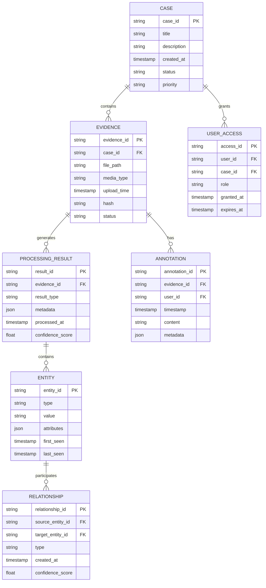

# Product Requirements Document (PRD)

# 1. INTRODUCTION

## 1.1 Purpose

This Software Requirements Specification (SRS) document provides a comprehensive description of the CrimeMiner system - an AI-powered investigative platform designed for law enforcement agencies. The document serves as the authoritative reference for technical teams, stakeholders, and development partners involved in building and maintaining the system. It details functional and non-functional requirements, system behaviors, and constraints that must be satisfied.

## 1.2 Scope

CrimeMiner is an enterprise-scale multimedia processing and analysis platform that enables law enforcement agencies to rapidly process, analyze and derive intelligence from massive volumes of digital evidence. The system encompasses:

- Automated ingestion and processing of audio, video, images, and text evidence
- AI-powered transcription, translation, and analysis capabilities
- Advanced search and discovery features with natural language processing
- Secure collaboration tools for investigations
- Automated reporting and visualization features
- FedRAMP and CJIS compliant infrastructure

Key benefits include:
- Reduction in manual evidence processing time
- Enhanced discovery of criminal intelligence and patterns
- Improved investigative efficiency and case closure rates
- Scalable processing of millions of minutes of multimedia content
- Defensible chain of custody for digital evidence

Core functionalities:
- Multi-format media ingestion (audio, video, text, images)
- Speech-to-text transcription with ≥95% accuracy
- Entity recognition and relationship mapping
- Semantic search and natural language querying
- Real-time alerts and notifications
- Collaborative case management
- Automated report generation
- Audit logging and evidence tracking

The system will be deployed as a cloud-based solution on AWS or Azure infrastructure, accessible via web and mobile interfaces, with APIs for integration with existing case management systems.

# 2. PRODUCT DESCRIPTION

## 2.1 Product Perspective

CrimeMiner operates as a cloud-native SaaS platform deployed on AWS or Azure infrastructure, integrating with existing law enforcement case management systems through secure APIs. The system functions as a standalone investigative platform while maintaining interoperability with:

- Agency case management systems
- Evidence management databases
- Criminal justice information systems
- External AI/ML services for specialized processing
- Agency-specific data repositories

The platform architecture consists of:
- Web and mobile front-end applications
- Distributed backend services for media processing
- Secure cloud storage for evidence
- Elasticsearch-powered search infrastructure
- Real-time notification system
- API gateway for external integrations

## 2.2 Product Functions

Core system functions include:

1. Evidence Processing
   - Multi-format media ingestion (audio, video, images, text)
   - Automated transcription and translation
   - Entity extraction and relationship mapping
   - Object and behavior detection
   - Sentiment and context analysis

2. Investigation Support
   - Natural language search and discovery
   - Real-time alerts and notifications
   - Collaborative case management
   - Timeline visualization
   - Network analysis graphs

3. Administrative Functions
   - User and role management
   - Case access control
   - Audit logging
   - System configuration
   - Usage reporting

4. Security and Compliance
   - Chain of custody tracking
   - Evidence integrity verification
   - Automated redaction
   - Compliance reporting

## 2.3 User Characteristics

Primary user personas include:

1. Investigator/Detective
   - Technical proficiency: Moderate
   - Usage frequency: Daily
   - Primary needs: Evidence processing, search, analysis
   - Access level: Case-specific

2. Intelligence Analyst
   - Technical proficiency: High
   - Usage frequency: Daily
   - Primary needs: Pattern analysis, relationship mapping
   - Access level: Multi-case

3. Supervisor
   - Technical proficiency: Moderate
   - Usage frequency: Weekly
   - Primary needs: Oversight, reporting, user management
   - Access level: Department-wide

4. System Administrator
   - Technical proficiency: Expert
   - Usage frequency: As needed
   - Primary needs: Configuration, maintenance
   - Access level: Full system

## 2.4 Constraints

1. Technical Constraints
   - Must operate within FedRAMP authorized cloud environments
   - Real-time processing limited by available computing resources
   - Storage capacity subject to cloud provider limits
   - API rate limits for external services

2. Regulatory Constraints
   - CJIS Security Policy compliance required
   - FedRAMP certification mandatory
   - Evidence handling must meet court admissibility standards
   - Data retention policies must align with agency requirements

3. Operational Constraints
   - Maximum 10-minute processing time for 1,000 15-minute audio files
   - Minimum 95% transcription accuracy
   - 99.9% system availability requirement
   - Maximum 1-hour recovery time objective (RTO)

4. Security Constraints
   - Multi-factor authentication mandatory
   - End-to-end encryption required
   - Air-gapped deployment support needed
   - Strict access control enforcement

## 2.5 Assumptions and Dependencies

Assumptions:
1. Agencies have sufficient internet bandwidth for cloud operations
2. Users have basic computer literacy
3. Evidence is provided in standard digital formats
4. Agencies maintain necessary security clearances
5. Source data quality meets minimum standards

Dependencies:
1. Cloud Platform Services
   - AWS/Azure infrastructure availability
   - Cloud provider compliance certifications
   - Platform service level agreements

2. External Services
   - AI/ML API availability
   - Translation service uptime
   - Integration partner systems

3. Agency Resources
   - Technical support staff
   - Training capacity
   - Hardware requirements
   - Network infrastructure

4. Regulatory Environment
   - Maintained certifications
   - Current compliance standards
   - Legal framework stability

# 3. PROCESS FLOWCHART

```mermaid
flowchart TD
    A[User Login with MFA] --> B{Role Check}
    B -->|Investigator| C[Case Management]
    B -->|Supervisor| D[Admin Dashboard]
    B -->|System Admin| E[System Configuration]
    
    C --> F[Create/Select Case]
    F --> G[Evidence Ingestion]
    
    G --> H{Media Type}
    H -->|Audio| I[Speech Processing]
    H -->|Video| J[Video Analysis]
    H -->|Text| K[Text Analysis]
    H -->|Image| L[Image Processing]
    
    I --> M[AI Processing Pipeline]
    J --> M
    K --> M
    L --> M
    
    M --> N[Entity Extraction]
    M --> O[Translation]
    M --> P[Transcription]
    M --> Q[Object Detection]
    
    N --> R[Intelligence Database]
    O --> R
    P --> R
    Q --> R
    
    R --> S[Search Index]
    R --> T[Alert System]
    
    S --> U[Investigation Interface]
    T --> U
    
    U --> V[Generate Reports]
    U --> W[Case Updates]
    U --> X[Evidence Export]
    
    subgraph Security Layer
        Y[Audit Logging]
        Z[Chain of Custody]
        AA[Access Control]
    end
    
    U --> Security Layer
    V --> Security Layer
    W --> Security Layer
    X --> Security Layer
```

```mermaid
flowchart TD
    A[Evidence Processing Pipeline] --> B{Concurrent Processing}
    
    B --> C[Audio Processing Service]
    C --> C1[Speech-to-Text]
    C --> C2[Speaker ID]
    C --> C3[Language Detection]
    
    B --> D[Video Processing Service]
    D --> D1[Frame Analysis]
    D --> D2[Object Detection]
    D --> D3[Face Detection]
    
    B --> E[Text Processing Service]
    E --> E1[NLP Analysis]
    E --> E2[Entity Recognition]
    E --> E3[Sentiment Analysis]
    
    C1 --> F[Evidence Store]
    C2 --> F
    C3 --> F
    D1 --> F
    D2 --> F
    D3 --> F
    E1 --> F
    E2 --> F
    E3 --> F
    
    F --> G[Elasticsearch Index]
    
    G --> H[Real-time Alerts]
    G --> I[Search API]
    G --> J[Analytics Engine]
    
    subgraph AWS/Azure Cloud
        K[Auto-scaling Groups]
        L[Load Balancers]
        M[Storage Services]
    end
    
    F --> AWS/Azure Cloud
    G --> AWS/Azure Cloud
```

# 4. FUNCTIONAL REQUIREMENTS

## 4.1 Evidence Processing Features

### F1: Multi-Format Media Ingestion
**ID**: F1  
**Description**: System must support ingestion of multiple media formats through web interface and API  
**Priority**: P0 (Critical)  

| Requirement ID | Requirement Description | Acceptance Criteria |
|---------------|------------------------|-------------------|
| F1.1 | Support upload of audio files (WAV, MP3, M4A) | Successfully process files up to 500MB |
| F1.2 | Support upload of video files (MP4, AVI, MOV) | Successfully process files up to 2GB |
| F1.3 | Support upload of images (JPEG, PNG, TIFF) | Successfully process files up to 100MB |
| F1.4 | Support upload of text documents (PDF, DOC, TXT) | Successfully process files up to 100MB |
| F1.5 | Provide bulk upload capability | Process 1000+ files simultaneously |
| F1.6 | Implement API endpoints for programmatic upload | REST API with 99.9% uptime |

### F2: Speech Processing
**ID**: F2  
**Description**: Convert audio to searchable text with speaker identification  
**Priority**: P0 (Critical)  

| Requirement ID | Requirement Description | Acceptance Criteria |
|---------------|------------------------|-------------------|
| F2.1 | Transcribe audio to text | ≥95% accuracy rate |
| F2.2 | Identify and tag distinct speakers | ≥90% accuracy in speaker separation |
| F2.3 | Support multiple languages | Cover top 10 most common languages |
| F2.4 | Process audio in near real-time | Complete within 2x audio duration |
| F2.5 | Handle background noise and multiple speakers | Maintain accuracy with 3+ simultaneous speakers |

### F3: Video Analysis
**ID**: F3  
**Description**: Extract intelligence from video content  
**Priority**: P1 (High)  

| Requirement ID | Requirement Description | Acceptance Criteria |
|---------------|------------------------|-------------------|
| F3.1 | Detect and track objects | ≥90% accuracy for common objects |
| F3.2 | Recognize license plates | ≥85% accuracy in daylight conditions |
| F3.3 | Identify suspicious behaviors | Flag predefined behavior patterns |
| F3.4 | Generate video thumbnails | Create preview every 30 seconds |
| F3.5 | Extract audio track for speech processing | Maintain audio quality |

### F4: Text Analysis
**ID**: F4  
**Description**: Process and analyze textual content  
**Priority**: P1 (High)  

| Requirement ID | Requirement Description | Acceptance Criteria |
|---------------|------------------------|-------------------|
| F4.1 | Extract entities (names, locations, dates) | ≥90% accuracy for named entities |
| F4.2 | Detect sentiment and context | ≥85% accuracy in context classification |
| F4.3 | Identify coded language patterns | Flag statistical anomalies in word usage |
| F4.4 | Generate text summaries | Create concise summaries under 250 words |
| F4.5 | Support multiple languages | Translate between 20+ languages |

### F5: Intelligence Generation
**ID**: F5  
**Description**: Create actionable insights from processed data  
**Priority**: P1 (High)  

| Requirement ID | Requirement Description | Acceptance Criteria |
|---------------|------------------------|-------------------|
| F5.1 | Generate relationship maps | Link entities across multiple sources |
| F5.2 | Create event timelines | Chronological ordering with 100% accuracy |
| F5.3 | Identify patterns and trends | Detect recurring patterns across cases |
| F5.4 | Generate automated reports | Include all relevant evidence and links |
| F5.5 | Alert on suspicious patterns | Real-time notifications for matches |

### F6: Search and Discovery
**ID**: F6  
**Description**: Enable efficient evidence search and retrieval  
**Priority**: P0 (Critical)  

| Requirement ID | Requirement Description | Acceptance Criteria |
|---------------|------------------------|-------------------|
| F6.1 | Provide full-text search | Sub-second response time |
| F6.2 | Support natural language queries | Understand complex search intent |
| F6.3 | Enable filtered search by metadata | Multiple filter combinations |
| F6.4 | Implement semantic search | Return contextually relevant results |
| F6.5 | Save and share searches | Persist search parameters |

### F7: Case Management
**ID**: F7  
**Description**: Organize and manage investigation cases  
**Priority**: P1 (High)  

| Requirement ID | Requirement Description | Acceptance Criteria |
|---------------|------------------------|-------------------|
| F7.1 | Create and manage cases | Support 10,000+ active cases |
| F7.2 | Assign user permissions | Role-based access control |
| F7.3 | Track chain of custody | Complete audit trail |
| F7.4 | Enable case collaboration | Real-time updates for team members |
| F7.5 | Export case data | Multiple export formats supported |

### F8: System Administration
**ID**: F8  
**Description**: Manage system configuration and maintenance  
**Priority**: P2 (Medium)  

| Requirement ID | Requirement Description | Acceptance Criteria |
|---------------|------------------------|-------------------|
| F8.1 | Manage user accounts | Handle 10,000+ user accounts |
| F8.2 | Configure system settings | Zero downtime updates |
| F8.3 | Monitor system health | Real-time performance metrics |
| F8.4 | Generate usage reports | Daily/weekly/monthly statistics |
| F8.5 | Manage storage allocation | Automatic storage scaling |

# 5. NON-FUNCTIONAL REQUIREMENTS

## 5.1 Performance Requirements

| Requirement | Description | Target Metric |
|------------|-------------|---------------|
| Response Time | Maximum time for system to respond to user queries | < 2 seconds for 95% of requests |
| Bulk Processing | Processing time for large evidence batches | 1,000 15-minute audio files in ≤10 minutes |
| Search Performance | Time to return search results | < 1 second for simple queries, < 3 seconds for complex |
| Concurrent Users | Number of simultaneous users supported | 10,000+ active users |
| API Throughput | API request handling capacity | 1,000 requests per second |
| Storage I/O | Read/write speeds for evidence files | Minimum 1 GB/s read, 500 MB/s write |
| Transcription Speed | Real-time factor for audio/video transcription | ≤ 0.5x duration of source media |
| Memory Usage | Maximum RAM usage per processing node | < 32GB per instance |

## 5.2 Safety Requirements

| Requirement | Description | Implementation |
|------------|-------------|----------------|
| Data Backup | Automated backup of all system data | Real-time replication with 15-minute RPO |
| Failover | System recovery in case of component failure | Automatic failover within 30 seconds |
| Data Corruption | Prevention of data corruption during processing | Checksum verification on all file operations |
| Error Handling | Graceful handling of system errors | Automated error logging and notification |
| Resource Monitoring | Continuous monitoring of system resources | Alert when usage exceeds 80% threshold |
| Data Recovery | Ability to recover from data loss scenarios | Point-in-time recovery up to 30 days |
| Process Isolation | Separation of critical system processes | Container-based isolation per process |
| Circuit Breaking | Prevention of cascade failures | Automatic circuit breaking at 90% load |

## 5.3 Security Requirements

| Requirement | Description | Implementation |
|------------|-------------|----------------|
| Authentication | User identity verification | Multi-factor authentication (MFA) mandatory |
| Authorization | Access control to system resources | Role-based access control (RBAC) |
| Data Encryption | Protection of data at rest and in transit | AES-256 encryption at rest, TLS 1.3 in transit |
| Audit Logging | Tracking of all system activities | Immutable audit logs with 1-year retention |
| Session Management | Secure handling of user sessions | 15-minute idle timeout, secure session tokens |
| Network Security | Protection of system network | WAF, IDS/IPS, VPC isolation |
| Key Management | Secure handling of encryption keys | HSM-based key management |
| Access Monitoring | Detection of unauthorized access attempts | Real-time security event monitoring |

## 5.4 Quality Requirements

### 5.4.1 Availability
- System uptime: 99.9% (excluding planned maintenance)
- Maximum planned downtime: 4 hours per month
- Unplanned downtime resolution: < 1 hour

### 5.4.2 Maintainability
- Code coverage: Minimum 80%
- Documentation: Complete API and system documentation
- Deployment automation: Zero-downtime deployments
- Update frequency: Security patches within 24 hours

### 5.4.3 Usability
- Training time: < 4 hours for basic proficiency
- Error rate: < 1% for common tasks
- Help documentation: Context-sensitive help
- Interface consistency: 100% compliance with style guide

### 5.4.4 Scalability
- Horizontal scaling: Support for 100+ processing nodes
- Storage scaling: Automatic scaling up to 1PB
- User scaling: Linear performance up to 100,000 users
- Database scaling: Automatic sharding and replication

### 5.4.5 Reliability
- Mean Time Between Failures (MTBF): > 720 hours
- Mean Time To Recovery (MTTR): < 15 minutes
- Data durability: 99.999999999%
- Transaction consistency: ACID compliance

## 5.5 Compliance Requirements

| Requirement | Description | Implementation |
|------------|-------------|----------------|
| FedRAMP | Federal security standards compliance | High baseline certification |
| CJIS | Criminal Justice Information Systems compliance | Full CJIS Security Policy compliance |
| NIST | National security standards | NIST 800-53 controls implementation |
| Chain of Custody | Evidence handling requirements | Digital signatures and immutable logs |
| Data Retention | Compliance with retention policies | Configurable retention periods |
| Privacy | Data privacy regulations | PII protection and access controls |
| Audit | Regular security audits | Quarterly third-party audits |
| Reporting | Compliance reporting requirements | Automated compliance reports |

# 6. DATA REQUIREMENTS

## 6.1 Data Models

### 6.1.1 Core Entities Relationship Diagram



## 6.2 Data Storage

### 6.2.1 Storage Requirements

| Data Type | Storage System | Retention Period | Backup Frequency |
|-----------|---------------|------------------|------------------|
| Raw Evidence | S3/Azure Blob (WORM) | 7 years minimum | Real-time replication |
| Processed Results | MongoDB/DocumentDB | 7 years minimum | Hourly snapshots |
| Search Indices | Elasticsearch | 7 years minimum | Daily snapshots |
| Metadata | PostgreSQL | 7 years minimum | Continuous WAL archiving |
| Audit Logs | Immutable Storage | 7 years minimum | Real-time replication |

### 6.2.2 Storage Architecture

- Primary Storage: Multi-region cloud storage with WORM (Write Once Read Many)
- Hot Storage: SSD-backed storage for active cases (< 90 days)
- Warm Storage: Standard storage for recent cases (90-365 days)
- Cold Storage: Archive storage for older cases (> 365 days)
- Backup: Cross-region replication with 99.999999999% durability

### 6.2.3 Data Redundancy

- Geographic Redundancy: Minimum 3 regions
- Replication Factor: 6x for critical data
- Recovery Point Objective (RPO): 15 minutes
- Recovery Time Objective (RTO): 1 hour

## 6.3 Data Processing

### 6.3.1 Data Flow Diagram

```mermaid
flowchart TD
    A[Evidence Ingestion] --> B{Validation Layer}
    B -->|Valid| C[Storage Layer]
    B -->|Invalid| D[Error Handler]
    
    C --> E[Processing Queue]
    E --> F{Media Type Router}
    
    F -->|Audio| G[Speech Processing]
    F -->|Video| H[Video Processing]
    F -->|Text| I[Text Processing]
    F -->|Image| J[Image Processing]
    
    G --> K[Results Store]
    H --> K
    I --> K
    J --> K
    
    K --> L[Search Index]
    K --> M[Analytics Store]
    
    subgraph Security Layer
        N[Encryption]
        O[Access Control]
        P[Audit Logging]
    end
    
    C --> Security Layer
    K --> Security Layer
    L --> Security Layer
    M --> Security Layer
```

### 6.3.2 Data Security

| Security Layer | Implementation | Purpose |
|----------------|----------------|----------|
| Encryption at Rest | AES-256 | Protect stored data |
| Encryption in Transit | TLS 1.3 | Secure data transfer |
| Access Control | RBAC + ABAC | Granular permissions |
| Key Management | AWS KMS/Azure Key Vault | Encryption key security |
| Data Masking | Dynamic redaction | PII protection |
| Audit Logging | Immutable logs | Compliance tracking |

### 6.3.3 Data Processing Rules

1. Evidence Ingestion
   - Validate file integrity
   - Generate SHA-256 hash
   - Create audit trail
   - Apply retention policies

2. Processing Pipeline
   - Parallel processing streams
   - Automatic error recovery
   - Quality threshold checks
   - Version control for results

3. Data Access
   - Case-level isolation
   - Role-based permissions
   - Time-based access controls
   - Audit logging of all access

4. Data Export
   - Controlled formats
   - Chain of custody preservation
   - Automated redaction
   - Export verification

# 7. EXTERNAL INTERFACES

## 7.1 User Interfaces

### 7.1.1 Web Application Interface

| Component | Description | Requirements |
|-----------|-------------|--------------|
| Login Screen | MFA-enabled secure login portal | - Support SSO integration<br>- Biometric authentication option<br>- Password complexity enforcement |
| Dashboard | Main investigation workspace | - Case overview cards<br>- Processing status indicators<br>- Real-time alerts panel<br>- Recent activity feed |
| Evidence Manager | Media upload and organization interface | - Drag-and-drop upload<br>- Progress indicators<br>- Batch operation controls<br>- File preview capabilities |
| Search Interface | Advanced search functionality | - Natural language query box<br>- Faceted filtering<br>- Results preview<br>- Save search functionality |
| Analytics View | Data visualization workspace | - Network graphs<br>- Timeline views<br>- Geospatial mapping<br>- Custom report builder |

### 7.1.2 Mobile Interface

| Component | Description | Requirements |
|-----------|-------------|--------------|
| Mobile Dashboard | Responsive case overview | - Touch-optimized controls<br>- Offline capability<br>- Push notifications<br>- Limited feature set |
| Evidence Capture | Direct media capture interface | - Camera integration<br>- Audio recording<br>- Automatic upload queue<br>- Metadata tagging |

## 7.2 Hardware Interfaces

### 7.2.1 Storage Systems

| Interface | Specification | Requirements |
|-----------|--------------|--------------|
| Cloud Storage | AWS S3/Azure Blob | - Direct upload/download<br>- Multipart transfer support<br>- Encryption at rest<br>- WORM capability |
| Local Cache | SSD Storage | - Min 1TB capacity<br>- NVMe interface<br>- 3000MB/s read speed<br>- 1500MB/s write speed |

### 7.2.2 Processing Systems

| Interface | Specification | Requirements |
|-----------|--------------|--------------|
| GPU Clusters | NVIDIA Tesla | - CUDA compatibility<br>- Min 16GB VRAM<br>- PCIe 4.0 interface<br>- Multi-GPU support |
| Network Cards | 10GbE/40GbE | - RDMA support<br>- Hardware encryption<br>- Jumbo frame support<br>- Load balancing |

## 7.3 Software Interfaces

### 7.3.1 External Services Integration

| Service Type | Interface Method | Requirements |
|-------------|------------------|--------------|
| Speech Recognition | REST API | - Azure Cognitive Services/AWS Transcribe<br>- Batch processing support<br>- Multiple language support<br>- Custom vocabulary integration |
| Translation Services | gRPC | - Real-time translation<br>- Language detection<br>- Custom terminology support<br>- Batch translation capability |
| Object Detection | REST API | - AWS Rekognition/Azure Computer Vision<br>- Custom model deployment<br>- Batch processing<br>- Confidence scoring |

### 7.3.2 Database Interfaces

| Database | Interface Type | Requirements |
|----------|---------------|--------------|
| PostgreSQL | Native Driver | - Connection pooling<br>- Async operations<br>- Prepared statements<br>- Replication support |
| Elasticsearch | REST API | - Bulk indexing<br>- Query DSL support<br>- Aggregation framework<br>- Scroll API |
| MongoDB | Native Driver | - ACID transactions<br>- Change streams<br>- Bulk operations<br>- Sharding support |

## 7.4 Communication Interfaces

### 7.4.1 Network Protocols

| Protocol | Usage | Requirements |
|----------|-------|--------------|
| HTTPS | Web Traffic | - TLS 1.3<br>- Certificate pinning<br>- HSTS enforcement<br>- Perfect forward secrecy |
| WebSocket | Real-time Updates | - Secure WebSocket (WSS)<br>- Auto-reconnection<br>- Message compression<br>- Binary message support |
| gRPC | Service Communication | - HTTP/2 transport<br>- Bi-directional streaming<br>- Load balancing<br>- Deadline propagation |

### 7.4.2 Integration Protocols

| Protocol | Usage | Requirements |
|----------|-------|--------------|
| REST | External APIs | - OpenAPI 3.0 specification<br>- JWT authentication<br>- Rate limiting<br>- Versioning support |
| Message Queue | Async Processing | - Apache Kafka/AWS SQS<br>- Guaranteed delivery<br>- Dead letter queues<br>- Message persistence |
| Event Bus | System Events | - AWS EventBridge/Azure Event Grid<br>- Event filtering<br>- Retry policies<br>- Event archiving |

# 8. APPENDICES

## 8.1 GLOSSARY

| Term | Definition |
|------|------------|
| Chain of Custody | Documentation showing the movement and handling of evidence from collection through analysis and presentation |
| Dead Letter Queue | A storage mechanism for messages that cannot be delivered to their intended recipients |
| Entity Extraction | The process of identifying and classifying key elements in text into predefined categories |
| WORM Storage | Write Once Read Many - storage that ensures data cannot be modified once written |
| Semantic Search | Search capability that understands the contextual meaning of search terms |
| Air-gapped | A security measure where a computer network is physically isolated from unsecured networks |
| Circuit Breaking | Design pattern that prevents cascading failures in distributed systems |
| Redaction | The process of removing or obscuring sensitive information from documents |

## 8.2 ACRONYMS

| Acronym | Definition |
|---------|------------|
| ABAC | Attribute-Based Access Control |
| ACID | Atomicity, Consistency, Isolation, Durability |
| API | Application Programming Interface |
| CJIS | Criminal Justice Information Services |
| DEA | Drug Enforcement Administration |
| DSL | Domain Specific Language |
| FBI | Federal Bureau of Investigation |
| FedRAMP | Federal Risk and Authorization Management Program |
| FOIA | Freedom of Information Act |
| GPU | Graphics Processing Unit |
| HSM | Hardware Security Module |
| HSTS | HTTP Strict Transport Security |
| IDS | Intrusion Detection System |
| IPS | Intrusion Prevention System |
| JWT | JSON Web Token |
| KMS | Key Management Service |
| MFA | Multi-Factor Authentication |
| NLP | Natural Language Processing |
| PII | Personally Identifiable Information |
| RBAC | Role-Based Access Control |
| RDMA | Remote Direct Memory Access |
| RPO | Recovery Point Objective |
| RTO | Recovery Time Objective |
| SaaS | Software as a Service |
| SSO | Single Sign-On |
| TLS | Transport Layer Security |
| VPC | Virtual Private Cloud |
| WAF | Web Application Firewall |
| WAL | Write-Ahead Logging |

## 8.3 ADDITIONAL REFERENCES

### 8.3.1 Technical Standards

| Standard | Description | Relevance |
|----------|-------------|-----------|
| NIST SP 800-53 | Security and Privacy Controls | System security requirements |
| ISO/IEC 27001 | Information Security Management | Security compliance framework |
| FIPS 140-2 | Cryptographic Module Validation | Encryption requirements |
| NIST SP 800-88 | Media Sanitization Guidelines | Evidence disposal procedures |

### 8.3.2 Legal References

| Reference | Description | Relevance |
|-----------|-------------|-----------|
| Federal Rules of Evidence | Guidelines for evidence admissibility | Chain of custody requirements |
| Privacy Act of 1974 | Privacy protection law | PII handling requirements |
| GDPR | Data protection regulation | International data handling |
| State Security Breach Laws | Data breach notification requirements | Incident response procedures |

### 8.3.3 Related Documentation

| Document | Description | Location |
|----------|-------------|----------|
| API Documentation | Detailed API specifications | /docs/api |
| Deployment Guide | System deployment procedures | /docs/deployment |
| Security Policies | Security implementation details | /docs/security |
| User Manual | End-user documentation | /docs/user |
| Integration Guide | Third-party integration procedures | /docs/integration |