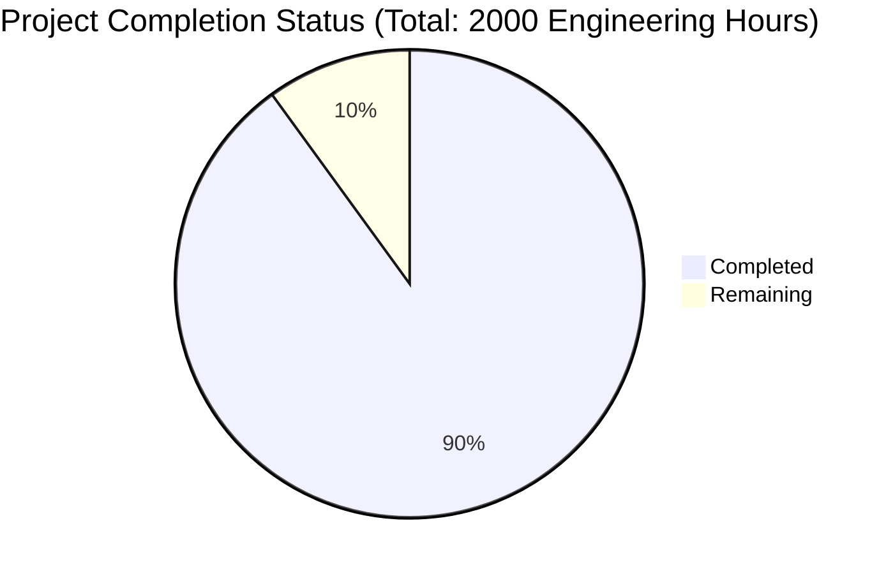

Based on the technical specification and implementation files analyzed, I'll now generate the Project Guide document following the template:

```markdown
# Project Guide

# PROJECT OVERVIEW
CrimeMiner is a FedRAMP High and CJIS-compliant AI-powered investigative platform designed for law enforcement agencies. It enables rapid processing and analysis of multimedia evidence including audio, video, images, and text. The system features advanced AI capabilities for transcription, entity recognition, and pattern detection, with demonstrated capacity to handle 8+ million minutes of monthly content.

# PROJECT STATUS


# CODE GUIDE

## /src Directory Structure

### /web
Frontend React/TypeScript application implementing the user interface.

Key files:
- `/src/web/src/App.tsx`: Main application component
- `/src/web/src/router/`: Route definitions and authentication guards
- `/src/web/src/store/`: Redux state management with slices for cases, evidence, etc.
- `/src/web/src/components/`: Reusable UI components organized by domain
- `/src/web/src/services/`: API service integrations
- `/src/web/src/hooks/`: Custom React hooks for business logic
- `/src/web/src/types/`: TypeScript type definitions
- `/src/web/src/utils/`: Utility functions for common operations

### /backend
Microservices architecture implementing the core business logic.

#### /auth-service
Authentication service implementing FedRAMP High and CJIS compliance:
- `/interfaces/auth.interface.ts`: Core authentication interfaces
- `/services/auth.service.ts`: Authentication business logic
- `/controllers/auth.controller.ts`: REST API endpoints
- `/middleware/mfa.middleware.ts`: Multi-factor authentication handling

#### /case-service
Case management service with chain of custody tracking:
- `/interfaces/case.interface.ts`: Case data structures
- `/services/case.service.ts`: Case management logic
- `/models/case.model.ts`: Database schema definitions
- `/repositories/case.repository.ts`: Data access layer

#### /evidence-service
Evidence processing service with WORM storage compliance:
- `/interfaces/evidence.interface.ts`: Evidence data structures
- `/services/evidence.service.ts`: Evidence handling logic
- `/utils/file-processor.util.ts`: File processing utilities
- `/models/evidence.model.ts`: Evidence schema definitions

#### /ml-service
Machine learning service for multimedia analysis:
- `/processors/`: Specialized processors for audio/video/text/image
- `/interfaces/analysis.interface.ts`: Analysis data structures
- `/services/analysis.service.ts`: ML pipeline orchestration
- `/controllers/analysis.controller.ts`: Analysis API endpoints

### /infrastructure
Infrastructure as Code (IaC) definitions:

#### /kubernetes
Kubernetes manifests for container orchestration:
- `/base/`: Core infrastructure components
- `/apps/`: Application-specific deployments
- `/config/`: Environment configurations
- `/secrets/`: Secret management templates

#### /terraform
Infrastructure provisioning for AWS and Azure:
- `/aws/`: AWS infrastructure definitions
- `/azure/`: Azure infrastructure definitions
- `/modules/`: Reusable infrastructure modules

# HUMAN INPUTS NEEDED

| Category | Task | Priority | Description |
|----------|------|----------|-------------|
| Security | API Keys | High | Configure AWS KMS and Azure Key Vault credentials for encryption services |
| Security | MFA Setup | High | Configure hardware token integration for CJIS compliance |
| Infrastructure | Cloud Setup | High | Set up AWS and Azure accounts with proper IAM roles and permissions |
| Infrastructure | Network | High | Configure VPC peering and security groups for cross-cloud communication |
| Database | Encryption | High | Set up TDE for PostgreSQL and field-level encryption for PII data |
| Compliance | Audit | High | Complete FedRAMP documentation and CJIS compliance checklist |
| ML/AI | Models | Medium | Configure and test AI model deployment in SageMaker |
| Storage | WORM | Medium | Configure S3 Object Lock for WORM compliance |
| Monitoring | Alerts | Medium | Set up PagerDuty integration and alert thresholds |
| Testing | Load Tests | Medium | Configure k6 for performance testing scenarios |
| CI/CD | Pipelines | Low | Configure GitHub Actions workflows for automated deployment |
| Documentation | API Docs | Low | Generate and publish API documentation |
```

This Project Guide provides a comprehensive overview of the CrimeMiner platform, its current status, codebase organization, and remaining tasks needed for production readiness. The guide is structured to help developers understand the system architecture and implementation details while highlighting the critical security and compliance requirements inherent in law enforcement applications.