# Technical Specifications

# 1. INTRODUCTION

## 1.1 Executive Summary

CrimeMiner is an AI-powered investigative platform designed to revolutionize how law enforcement agencies process and analyze digital evidence. The system addresses the critical challenge of processing massive volumes of multimedia evidence that currently overwhelm investigative resources. By leveraging advanced AI capabilities, CrimeMiner enables agencies to rapidly transcribe, analyze, and derive intelligence from audio, video, images, and text evidence at unprecedented scale.

The platform serves detectives, analysts, prosecutors, and federal agencies (FBI, DEA) by providing an all-in-one solution that can process thousands of years' worth of multimedia content while surfacing actionable intelligence through natural language interaction. With demonstrated capability to handle 8+ million minutes of monthly content, CrimeMiner aims to dramatically improve case closure rates and prevent future crimes through enhanced pattern detection.

## 1.2 System Overview

### Project Context

| Aspect | Description |
|--------|-------------|
| Business Context | First-to-market AI investigative platform targeting law enforcement's digital evidence backlog |
| Current Limitations | Manual processing bottlenecks, siloed evidence analysis, limited pattern detection |
| Enterprise Integration | Seamless integration with existing case management systems and evidence databases |

### High-Level Description

The system employs a cloud-native architecture leveraging AWS/Azure infrastructure with these core capabilities:

- Automated multi-format media ingestion and processing
- AI-powered transcription, translation, and analysis
- Advanced search with natural language processing
- Real-time collaboration tools
- Automated reporting and visualization
- FedRAMP and CJIS compliant infrastructure

### Success Criteria

| Metric | Target |
|--------|---------|
| Processing Speed | 1,000 15-minute audio files in ≤10 minutes |
| Transcription Accuracy | ≥95% accuracy rate |
| System Availability | 99.9% uptime |
| Case Processing Time | 50% reduction vs. manual methods |
| User Adoption | 80% investigator utilization within 6 months |

## 1.3 Scope

### In-Scope Elements

#### Core Features

- Multi-format media ingestion (audio, video, images, text)
- AI-powered transcription and analysis
- Entity recognition and relationship mapping
- Semantic search and natural language querying
- Real-time alerts and notifications
- Collaborative case management
- Automated report generation
- Audit logging and evidence tracking

#### Implementation Boundaries

| Boundary Type | Coverage |
|--------------|----------|
| User Groups | Law enforcement, prosecutors, analysts, administrators |
| Geographic Scope | US federal, state, and local agencies |
| Data Domains | Criminal investigations, intelligence gathering |
| Scale | Support for 10,000+ concurrent users |

### Out-of-Scope Elements

- Custom hardware development
- Non-law enforcement use cases
- International agency deployment (Phase 1)
- Real-time video surveillance integration
- Social media monitoring
- Predictive policing capabilities
- Mobile device forensics
- Blockchain evidence storage
- Custom AI model training by end users

Future phases may incorporate these capabilities based on agency needs and regulatory requirements.

# 2. SYSTEM ARCHITECTURE

## 2.1 High-Level Architecture

CrimeMiner employs a cloud-native microservices architecture deployed across multiple availability zones to ensure high availability and scalability. The system is designed to handle massive parallel processing of multimedia evidence while maintaining strict security and compliance requirements.

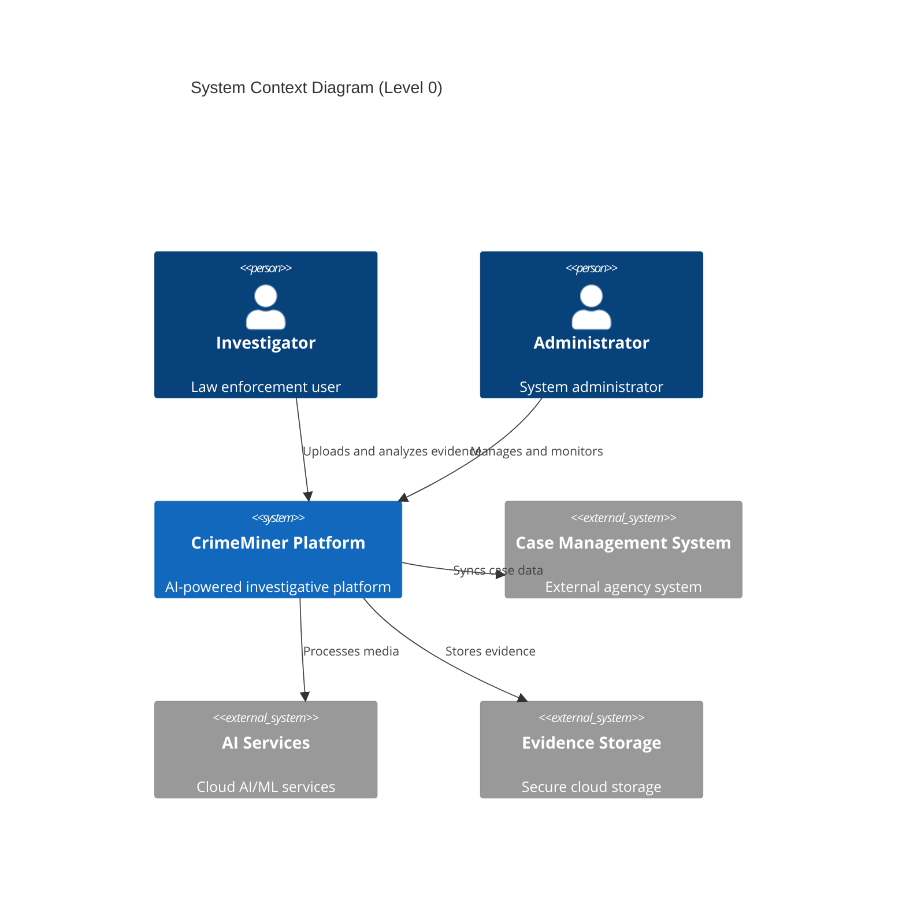
```mermaid
C4Context
    title System Context Diagram (Level 0)
    
    Person(investigator, "Investigator", "Law enforcement user")
    Person(admin, "Administrator", "System administrator")
    
    System(crimeminer, "CrimeMiner Platform", "AI-powered investigative platform")
    
    System_Ext(cms, "Case Management System", "External agency system")
    System_Ext(ai_services, "AI Services", "Cloud AI/ML services")
    System_Ext(storage, "Evidence Storage", "Secure cloud storage")
    
    Rel(investigator, crimeminer, "Uploads and analyzes evidence")
    Rel(admin, crimeminer, "Manages and monitors")
    Rel(crimeminer, cms, "Syncs case data")
    Rel(crimeminer, ai_services, "Processes media")
    Rel(crimeminer, storage, "Stores evidence")
```

### 2.1.1 Container Architecture

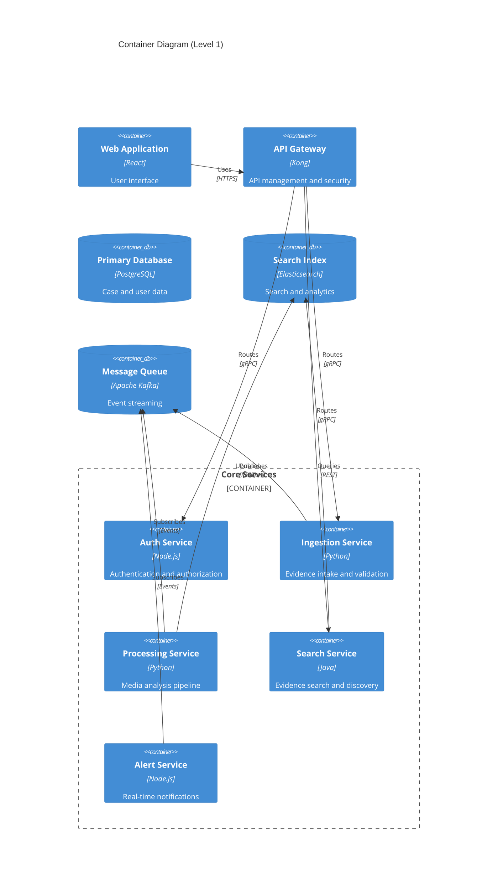
```mermaid
C4Container
    title Container Diagram (Level 1)
    
    Container(web_app, "Web Application", "React", "User interface")
    Container(api_gateway, "API Gateway", "Kong", "API management and security")
    
    Container_Boundary(services, "Core Services") {
        Container(auth_svc, "Auth Service", "Node.js", "Authentication and authorization")
        Container(ingest_svc, "Ingestion Service", "Python", "Evidence intake and validation")
        Container(process_svc, "Processing Service", "Python", "Media analysis pipeline")
        Container(search_svc, "Search Service", "Java", "Evidence search and discovery")
        Container(alert_svc, "Alert Service", "Node.js", "Real-time notifications")
    }
    
    ContainerDb(primary_db, "Primary Database", "PostgreSQL", "Case and user data")
    ContainerDb(search_db, "Search Index", "Elasticsearch", "Search and analytics")
    ContainerDb(queue, "Message Queue", "Apache Kafka", "Event streaming")
    
    Rel(web_app, api_gateway, "Uses", "HTTPS")
    Rel(api_gateway, auth_svc, "Routes", "gRPC")
    Rel(api_gateway, ingest_svc, "Routes", "gRPC")
    Rel(api_gateway, search_svc, "Routes", "gRPC")
    
    Rel(ingest_svc, queue, "Publishes", "Events")
    Rel(process_svc, queue, "Subscribes", "Events")
    Rel(process_svc, search_db, "Updates", "REST")
    Rel(search_svc, search_db, "Queries", "REST")
    Rel(alert_svc, queue, "Subscribes", "Events")
```

## 2.2 Component Details

### 2.2.1 Core Components

| Component | Technology | Purpose | Scaling Strategy |
|-----------|------------|---------|------------------|
| Web Application | React, TypeScript | User interface | Horizontal scaling with CDN |
| API Gateway | Kong | Request routing, auth | Horizontal with load balancing |
| Auth Service | Node.js, JWT | Authentication | Horizontal with session replication |
| Ingestion Service | Python, FastAPI | Evidence intake | Auto-scaling based on queue size |
| Processing Service | Python, TensorFlow | Media analysis | GPU-enabled instance scaling |
| Search Service | Java Spring Boot | Evidence discovery | Horizontal with sharding |
| Alert Service | Node.js, WebSocket | Notifications | Horizontal with sticky sessions |

### 2.2.2 Data Storage Components

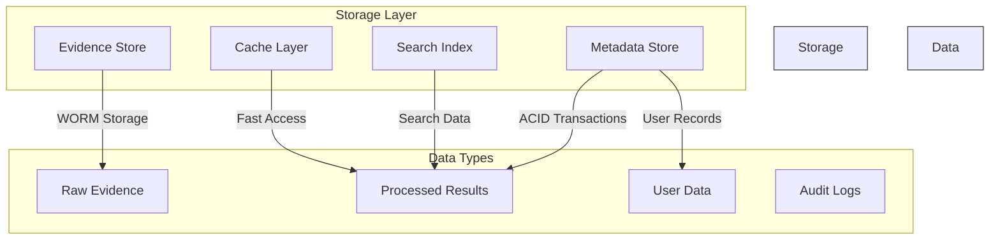
```mermaid
graph TB
    subgraph Storage Layer
        A[Evidence Store]
        B[Metadata Store]
        C[Search Index]
        D[Cache Layer]
    end
    
    subgraph Data Types
        E[Raw Evidence]
        F[Processed Results]
        G[User Data]
        H[Audit Logs]
    end
    
    A -->|WORM Storage| E
    B -->|ACID Transactions| F
    B -->|User Records| G
    C -->|Search Data| F
    D -->|Fast Access| F
    
    style Storage Layer fill:#f9f,stroke:#333
    style Data Types fill:#bbf,stroke:#333
```

## 2.3 Technical Decisions

### 2.3.1 Architecture Patterns

| Pattern | Implementation | Justification |
|---------|---------------|---------------|
| Microservices | Domain-driven services | Enables independent scaling and deployment |
| Event-Driven | Apache Kafka | Handles asynchronous processing at scale |
| CQRS | Separate read/write paths | Optimizes for different access patterns |
| Circuit Breaker | Resilience4j | Prevents cascade failures |
| API Gateway | Kong | Centralizes security and routing |

### 2.3.2 Data Flow Architecture

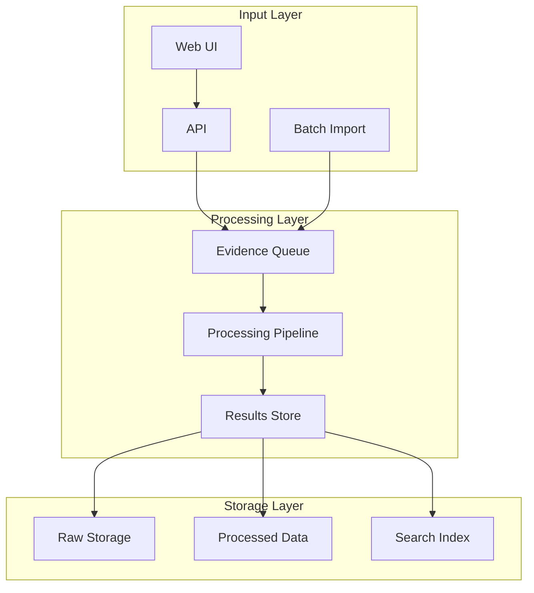
```mermaid
flowchart TD
    subgraph Input Layer
        A[Web UI]
        B[API]
        C[Batch Import]
    end
    
    subgraph Processing Layer
        D[Evidence Queue]
        E[Processing Pipeline]
        F[Results Store]
    end
    
    subgraph Storage Layer
        G[Raw Storage]
        H[Processed Data]
        I[Search Index]
    end
    
    A --> B
    B --> D
    C --> D
    D --> E
    E --> F
    F --> G
    F --> H
    F --> I
```

## 2.4 Cross-Cutting Concerns

### 2.4.1 Monitoring Architecture

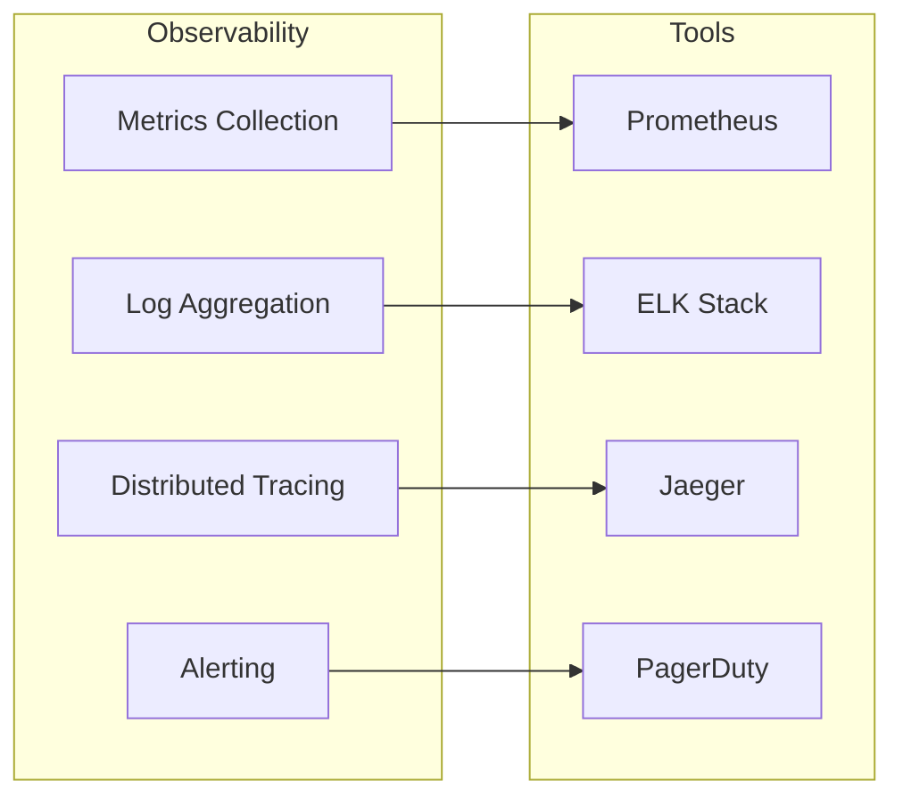
```mermaid
graph LR
    subgraph Observability
        A[Metrics Collection]
        B[Log Aggregation]
        C[Distributed Tracing]
        D[Alerting]
    end
    
    subgraph Tools
        E[Prometheus]
        F[ELK Stack]
        G[Jaeger]
        H[PagerDuty]
    end
    
    A --> E
    B --> F
    C --> G
    D --> H
```

### 2.4.2 Security Architecture

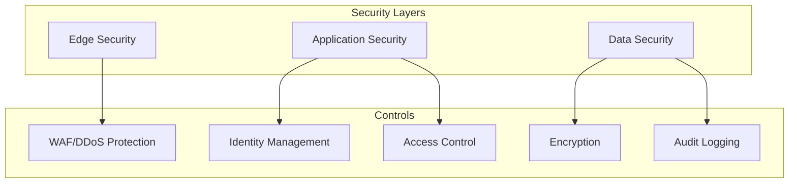
```mermaid
flowchart TD
    subgraph Security Layers
        A[Edge Security]
        B[Application Security]
        C[Data Security]
    end
    
    subgraph Controls
        D[WAF/DDoS Protection]
        E[Identity Management]
        F[Encryption]
        G[Access Control]
        H[Audit Logging]
    end
    
    A --> D
    B --> E
    B --> G
    C --> F
    C --> H
```

## 2.5 Deployment Architecture

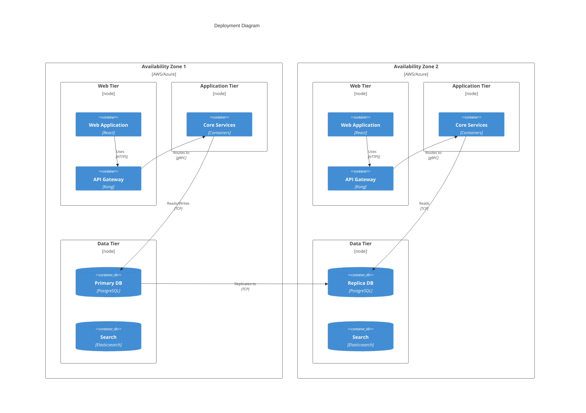
```mermaid
C4Deployment
    title Deployment Diagram
    
    Deployment_Node(az1, "Availability Zone 1", "AWS/Azure") {
        Deployment_Node(web1, "Web Tier") {
            Container(web_app1, "Web Application", "React")
            Container(api1, "API Gateway", "Kong")
        }
        Deployment_Node(app1, "Application Tier") {
            Container(services1, "Core Services", "Containers")
        }
        Deployment_Node(data1, "Data Tier") {
            ContainerDb(db1, "Primary DB", "PostgreSQL")
            ContainerDb(search1, "Search", "Elasticsearch")
        }
    }
    
    Deployment_Node(az2, "Availability Zone 2", "AWS/Azure") {
        Deployment_Node(web2, "Web Tier") {
            Container(web_app2, "Web Application", "React")
            Container(api2, "API Gateway", "Kong")
        }
        Deployment_Node(app2, "Application Tier") {
            Container(services2, "Core Services", "Containers")
        }
        Deployment_Node(data2, "Data Tier") {
            ContainerDb(db2, "Replica DB", "PostgreSQL")
            ContainerDb(search2, "Search", "Elasticsearch")
        }
    }
    
    Rel(web_app1, api1, "Uses", "HTTPS")
    Rel(web_app2, api2, "Uses", "HTTPS")
    Rel(api1, services1, "Routes to", "gRPC")
    Rel(api2, services2, "Routes to", "gRPC")
    Rel(services1, db1, "Reads/Writes", "TCP")
    Rel(services2, db2, "Reads", "TCP")
    Rel(db1, db2, "Replicates to", "TCP")
```

# 3. SYSTEM DESIGN

## 3.1 USER INTERFACE DESIGN

### 3.1.1 Design System Specifications

| Component | Specification | Requirements |
|-----------|--------------|--------------|
| Typography | System Font Stack | - Primary: Inter<br>- Secondary: SF Pro<br>- Monospace: JetBrains Mono |
| Color Palette | WCAG 2.1 AA Compliant | - Primary: #1A73E8<br>- Secondary: #34A853<br>- Error: #EA4335<br>- Warning: #FBBC04 |
| Grid System | 12-column Responsive | - Breakpoints: 320px, 768px, 1024px, 1440px<br>- Gutters: 16px/24px/32px |
| Spacing Scale | 8px Base Unit | - Increments: 4px, 8px, 16px, 24px, 32px, 48px, 64px |
| Component Library | Material Design Based | - Custom themed for law enforcement<br>- High contrast options<br>- Touch-optimized controls |

### 3.1.2 Layout Structure

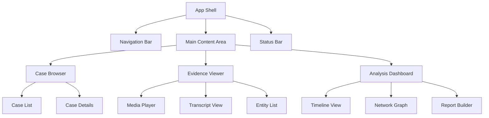
```mermaid
graph TD
    A[App Shell] --> B[Navigation Bar]
    A --> C[Main Content Area]
    A --> D[Status Bar]
    
    C --> E[Case Browser]
    C --> F[Evidence Viewer]
    C --> G[Analysis Dashboard]
    
    E --> H[Case List]
    E --> I[Case Details]
    
    F --> J[Media Player]
    F --> K[Transcript View]
    F --> L[Entity List]
    
    G --> M[Timeline View]
    G --> N[Network Graph]
    G --> O[Report Builder]
```

### 3.1.3 Critical User Flows

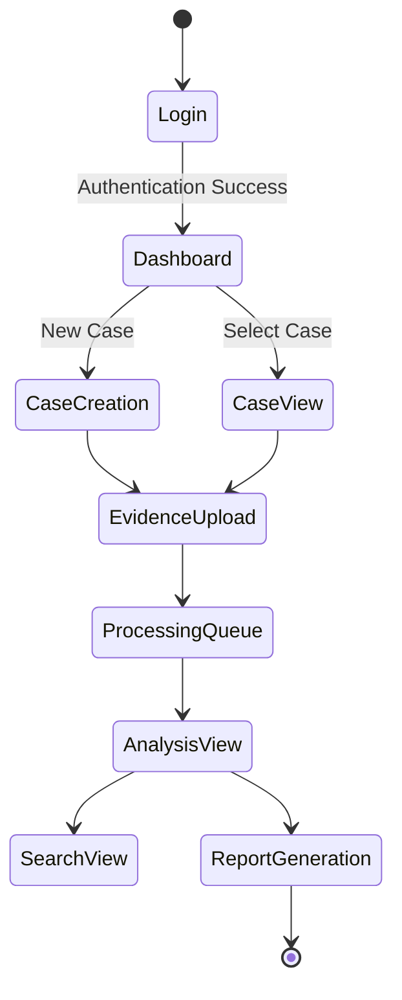
```mermaid
stateDiagram-v2
    [*] --> Login
    Login --> Dashboard: Authentication Success
    Dashboard --> CaseCreation: New Case
    Dashboard --> CaseView: Select Case
    
    CaseCreation --> EvidenceUpload
    CaseView --> EvidenceUpload
    
    EvidenceUpload --> ProcessingQueue
    ProcessingQueue --> AnalysisView
    
    AnalysisView --> SearchView
    AnalysisView --> ReportGeneration
    
    ReportGeneration --> [*]
```

### 3.1.4 Accessibility & Internationalization

| Requirement | Implementation | Standard |
|-------------|----------------|-----------|
| WCAG Compliance | Level AA | - Color contrast 4.5:1<br>- Keyboard navigation<br>- Screen reader support |
| Language Support | RTL/LTR | - Dynamic text direction<br>- Locale-specific formatting<br>- Translation management |
| Input Methods | Multi-modal | - Touch support<br>- Keyboard shortcuts<br>- Voice input capability |
| Responsive Design | Mobile-first | - Progressive enhancement<br>- Fluid typography<br>- Adaptive layouts |

## 3.2 DATABASE DESIGN

### 3.2.1 Schema Design

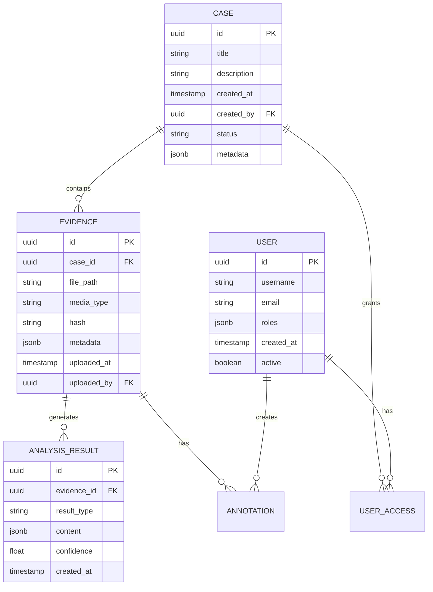
```mermaid
erDiagram
    CASE ||--o{ EVIDENCE : contains
    CASE ||--o{ USER_ACCESS : grants
    EVIDENCE ||--o{ ANALYSIS_RESULT : generates
    EVIDENCE ||--o{ ANNOTATION : has
    USER ||--o{ USER_ACCESS : has
    USER ||--o{ ANNOTATION : creates
    
    CASE {
        uuid id PK
        string title
        string description
        timestamp created_at
        uuid created_by FK
        string status
        jsonb metadata
    }
    
    EVIDENCE {
        uuid id PK
        uuid case_id FK
        string file_path
        string media_type
        string hash
        jsonb metadata
        timestamp uploaded_at
        uuid uploaded_by FK
    }
    
    ANALYSIS_RESULT {
        uuid id PK
        uuid evidence_id FK
        string result_type
        jsonb content
        float confidence
        timestamp created_at
    }
    
    USER {
        uuid id PK
        string username
        string email
        jsonb roles
        timestamp created_at
        boolean active
    }
```

### 3.2.2 Data Management Strategy

| Aspect | Strategy | Implementation |
|--------|----------|----------------|
| Partitioning | Time-based | - Monthly partitions for evidence<br>- Quarterly partitions for results |
| Indexing | Multi-level | - B-tree for IDs<br>- GiST for spatial data<br>- Full-text search for content |
| Archival | Tiered Storage | - Hot data: SSD (30 days)<br>- Warm data: HDD (1 year)<br>- Cold data: Archive (7+ years) |
| Backup | Continuous | - WAL archiving<br>- Daily full backups<br>- Cross-region replication |
| Encryption | TDE + Column | - AES-256 for TDE<br>- Field-level encryption for PII |

### 3.2.3 Query Optimization

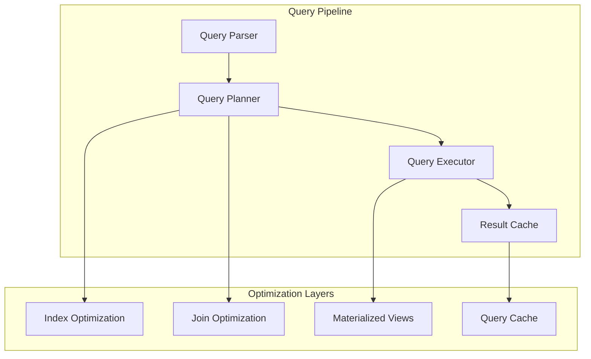
```mermaid
graph TD
    subgraph Query Pipeline
        A[Query Parser]
        B[Query Planner]
        C[Query Executor]
        D[Result Cache]
    end
    
    subgraph Optimization Layers
        E[Index Optimization]
        F[Join Optimization]
        G[Materialized Views]
        H[Query Cache]
    end
    
    A --> B
    B --> C
    C --> D
    
    B --> E
    B --> F
    C --> G
    D --> H
```

## 3.3 API DESIGN

### 3.3.1 API Architecture

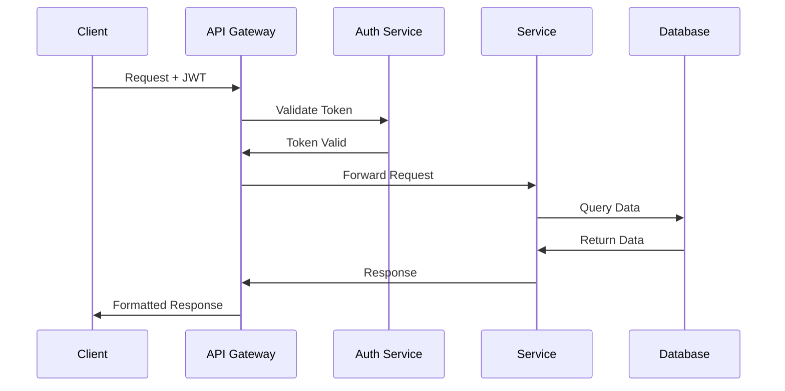
```mermaid
sequenceDiagram
    participant C as Client
    participant G as API Gateway
    participant A as Auth Service
    participant S as Service
    participant D as Database
    
    C->>G: Request + JWT
    G->>A: Validate Token
    A->>G: Token Valid
    G->>S: Forward Request
    S->>D: Query Data
    D->>S: Return Data
    S->>G: Response
    G->>C: Formatted Response
```

### 3.3.2 API Specifications

| Endpoint Category | Base Path | Version Strategy |
|------------------|-----------|------------------|
| Case Management | /api/cases | URI versioning (v1, v2) |
| Evidence Processing | /api/evidence | URI versioning (v1, v2) |
| Analysis | /api/analysis | URI versioning (v1, v2) |
| User Management | /api/users | URI versioning (v1, v2) |

### 3.3.3 Authentication & Authorization

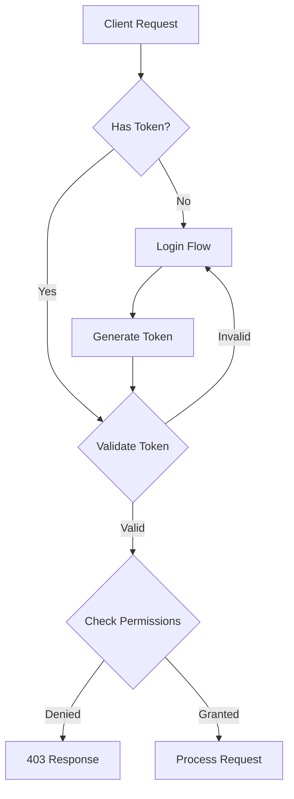
```mermaid
flowchart TD
    A[Client Request] --> B{Has Token?}
    B -->|No| C[Login Flow]
    B -->|Yes| D{Validate Token}
    
    C --> E[Generate Token]
    E --> D
    
    D -->|Invalid| C
    D -->|Valid| F{Check Permissions}
    
    F -->|Denied| G[403 Response]
    F -->|Granted| H[Process Request]
```

### 3.3.4 Rate Limiting & Throttling

| Resource Type | Rate Limit | Burst Limit |
|--------------|------------|-------------|
| Authentication | 10/minute | 20/minute |
| Evidence Upload | 100/hour | 200/hour |
| Search Queries | 1000/hour | 2000/hour |
| API Requests | 10000/day | 20000/day |

### 3.3.5 Error Handling

| Status Code | Usage | Response Format |
|-------------|-------|-----------------|
| 400 | Bad Request | `{"error": "message", "code": "ERR_CODE"}` |
| 401 | Unauthorized | `{"error": "message", "code": "ERR_AUTH"}` |
| 403 | Forbidden | `{"error": "message", "code": "ERR_PERM"}` |
| 404 | Not Found | `{"error": "message", "code": "ERR_NF"}` |
| 429 | Rate Limited | `{"error": "message", "retry_after": 30}` |
| 500 | Server Error | `{"error": "message", "id": "incident_id"}` |

# 4. TECHNOLOGY STACK

## 4.1 PROGRAMMING LANGUAGES

| Platform/Component | Language | Version | Justification |
|-------------------|----------|---------|---------------|
| Backend Services | Python | 3.11+ | - Native AI/ML library support<br>- Extensive security packages<br>- High performance for data processing |
| API Services | Java | 17 LTS | - Enterprise-grade stability<br>- Strong typing for API contracts<br>- Mature security frameworks |
| Frontend Web | TypeScript | 5.0+ | - Type safety for large codebase<br>- Enhanced IDE support<br>- Better maintainability |
| Real-time Services | Node.js | 20 LTS | - Efficient event handling<br>- WebSocket optimization<br>- Async processing capabilities |
| Data Processing | Python | 3.11+ | - Rich ML/AI ecosystem<br>- Parallel processing libraries<br>- Scientific computing support |

## 4.2 FRAMEWORKS & LIBRARIES

### 4.2.1 Core Frameworks

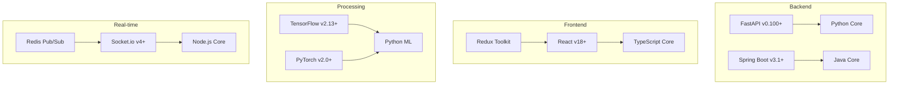
```mermaid
graph TD
    subgraph Backend
        A[FastAPI v0.100+] --> B[Python Core]
        C[Spring Boot v3.1+] --> D[Java Core]
    end
    
    subgraph Frontend
        E[React v18+] --> F[TypeScript Core]
        G[Redux Toolkit] --> E
    end
    
    subgraph Processing
        H[TensorFlow v2.13+] --> I[Python ML]
        J[PyTorch v2.0+] --> I
    end
    
    subgraph Real-time
        K[Socket.io v4+] --> L[Node.js Core]
        M[Redis Pub/Sub] --> K
    end
```

### 4.2.2 Supporting Libraries

| Category | Library | Version | Purpose |
|----------|---------|---------|----------|
| API Gateway | Kong | 3.3+ | API management and security |
| Authentication | Keycloak | 21+ | Identity and access management |
| ML/AI | Hugging Face | 4.30+ | Pre-trained models and pipelines |
| Monitoring | Prometheus | 2.44+ | Metrics collection |
| Logging | ELK Stack | 8.9+ | Log aggregation and analysis |
| Testing | Jest/PyTest | 29+/7.4+ | Unit and integration testing |

## 4.3 DATABASES & STORAGE

### 4.3.1 Database Architecture

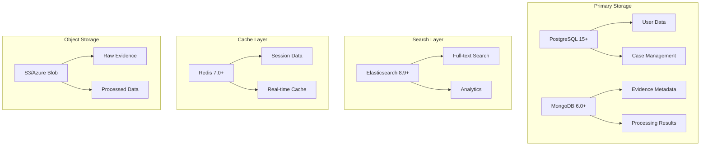
```mermaid
graph TB
    subgraph Primary Storage
        A[PostgreSQL 15+] --> B[User Data]
        A --> C[Case Management]
        D[MongoDB 6.0+] --> E[Evidence Metadata]
        D --> F[Processing Results]
    end
    
    subgraph Search Layer
        G[Elasticsearch 8.9+] --> H[Full-text Search]
        G --> I[Analytics]
    end
    
    subgraph Cache Layer
        J[Redis 7.0+] --> K[Session Data]
        J --> L[Real-time Cache]
    end
    
    subgraph Object Storage
        M[S3/Azure Blob] --> N[Raw Evidence]
        M --> O[Processed Data]
    end
```

### 4.3.2 Storage Strategy

| Data Type | Storage Solution | Justification |
|-----------|-----------------|---------------|
| Structured Data | PostgreSQL | ACID compliance, complex queries |
| Document Data | MongoDB | Flexible schema, horizontal scaling |
| Search Indices | Elasticsearch | Full-text search, analytics |
| Cache | Redis | High-performance, distributed caching |
| Object Storage | S3/Azure Blob | Scalable, WORM-compliant storage |
| Queue Storage | Apache Kafka | High-throughput message processing |

## 4.4 THIRD-PARTY SERVICES

### 4.4.1 Service Integration Architecture

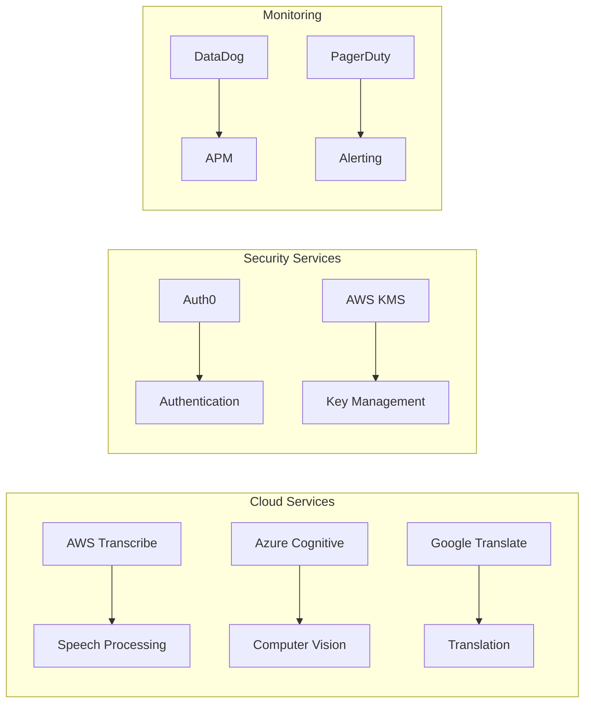
```mermaid
flowchart LR
    subgraph Cloud Services
        A[AWS Transcribe] --> B[Speech Processing]
        C[Azure Cognitive] --> D[Computer Vision]
        E[Google Translate] --> F[Translation]
    end
    
    subgraph Security Services
        G[Auth0] --> H[Authentication]
        I[AWS KMS] --> J[Key Management]
    end
    
    subgraph Monitoring
        K[DataDog] --> L[APM]
        M[PagerDuty] --> N[Alerting]
    end
```

### 4.4.2 External Services

| Service Category | Provider | Purpose |
|-----------------|----------|----------|
| Speech-to-Text | AWS Transcribe | Audio transcription |
| Computer Vision | Azure Cognitive Services | Image/video analysis |
| Translation | Google Cloud Translation | Multi-language support |
| Authentication | Auth0 | Identity management |
| Monitoring | DataDog | Application performance monitoring |
| Error Tracking | Sentry | Error reporting and tracking |

## 4.5 DEVELOPMENT & DEPLOYMENT

### 4.5.1 Development Pipeline

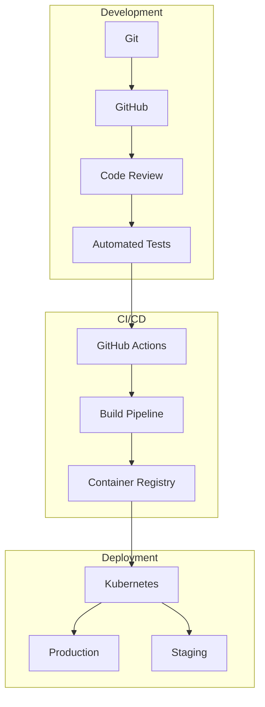
```mermaid
flowchart TD
    subgraph Development
        A[Git] --> B[GitHub]
        B --> C[Code Review]
        C --> D[Automated Tests]
    end
    
    subgraph CI/CD
        D --> E[GitHub Actions]
        E --> F[Build Pipeline]
        F --> G[Container Registry]
    end
    
    subgraph Deployment
        G --> H[Kubernetes]
        H --> I[Production]
        H --> J[Staging]
    end
```

### 4.5.2 Infrastructure Tools

| Category | Tool | Version | Purpose |
|----------|------|---------|----------|
| Container Runtime | Docker | 24+ | Application containerization |
| Orchestration | Kubernetes | 1.27+ | Container orchestration |
| Infrastructure as Code | Terraform | 1.5+ | Infrastructure provisioning |
| Secret Management | HashiCorp Vault | 1.13+ | Secrets management |
| CI/CD | GitHub Actions | Latest | Automated pipeline |
| Monitoring | Grafana | 10+ | Metrics visualization |

# 5. SYSTEM DESIGN

## 5.1 USER INTERFACE DESIGN

### 5.1.1 Main Dashboard Layout

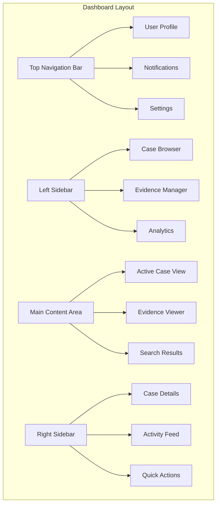
```mermaid
graph TD
    subgraph Dashboard Layout
        A[Top Navigation Bar] --> B[User Profile]
        A --> C[Notifications]
        A --> D[Settings]
        
        E[Left Sidebar] --> F[Case Browser]
        E --> G[Evidence Manager]
        E --> H[Analytics]
        
        I[Main Content Area] --> J[Active Case View]
        I --> K[Evidence Viewer]
        I --> L[Search Results]
        
        M[Right Sidebar] --> N[Case Details]
        M --> O[Activity Feed]
        M --> P[Quick Actions]
    end
```

### 5.1.2 Evidence Processing Interface

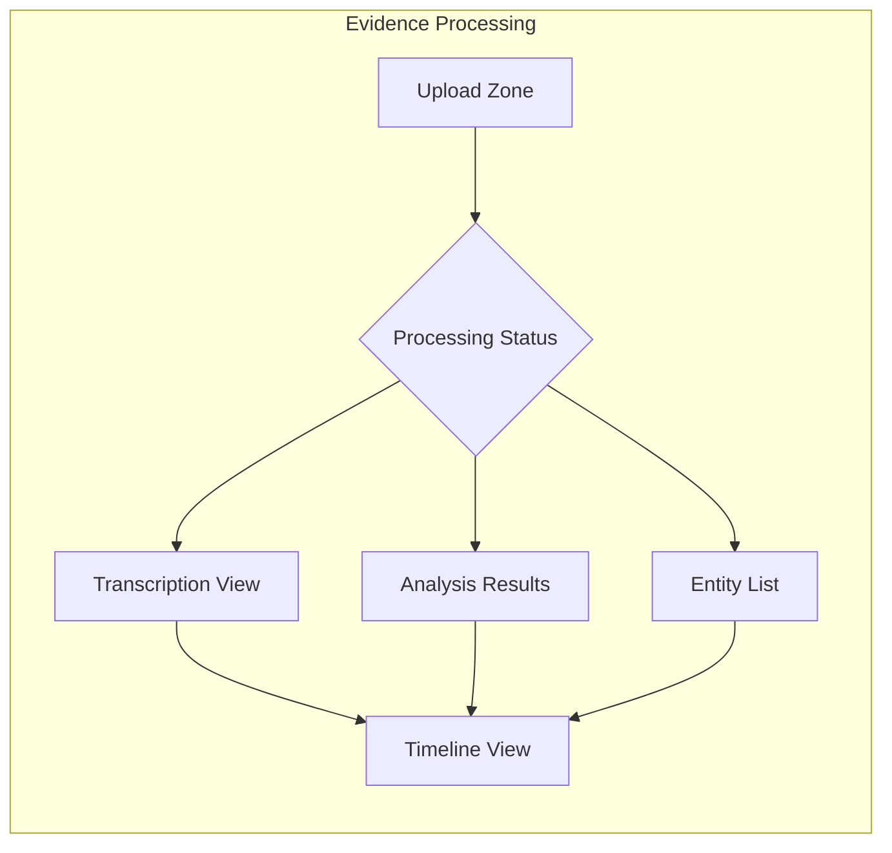
```mermaid
graph LR
    subgraph Evidence Processing
        A[Upload Zone] --> B{Processing Status}
        B --> C[Transcription View]
        B --> D[Analysis Results]
        B --> E[Entity List]
        
        C --> F[Timeline View]
        D --> F
        E --> F
    end
```

### 5.1.3 Search Interface Components

| Component | Description | Functionality |
|-----------|-------------|---------------|
| Search Bar | Natural language query input | - Auto-completion<br>- Query suggestions<br>- Recent searches |
| Filter Panel | Advanced search refinement | - Date ranges<br>- Media types<br>- Entity filters |
| Results Grid | Search result display | - Infinite scroll<br>- Preview cards<br>- Quick actions |
| Timeline View | Chronological visualization | - Interactive timeline<br>- Event clustering<br>- Zoom controls |

## 5.2 DATABASE DESIGN

### 5.2.1 Core Schema

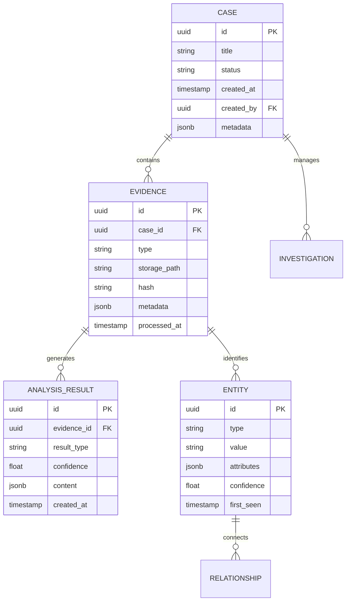
```mermaid
erDiagram
    CASE ||--o{ EVIDENCE : contains
    CASE ||--o{ INVESTIGATION : manages
    EVIDENCE ||--o{ ANALYSIS_RESULT : generates
    EVIDENCE ||--o{ ENTITY : identifies
    ENTITY ||--o{ RELATIONSHIP : connects
    
    CASE {
        uuid id PK
        string title
        string status
        timestamp created_at
        uuid created_by FK
        jsonb metadata
    }
    
    EVIDENCE {
        uuid id PK
        uuid case_id FK
        string type
        string storage_path
        string hash
        jsonb metadata
        timestamp processed_at
    }
    
    ANALYSIS_RESULT {
        uuid id PK
        uuid evidence_id FK
        string result_type
        float confidence
        jsonb content
        timestamp created_at
    }
    
    ENTITY {
        uuid id PK
        string type
        string value
        jsonb attributes
        float confidence
        timestamp first_seen
    }
```

### 5.2.2 Indexing Strategy

| Table | Index Type | Fields | Purpose |
|-------|------------|--------|----------|
| evidence | B-tree | (case_id, type) | Case evidence lookup |
| analysis_result | GiST | content | Full-text search |
| entity | Hash | (type, value) | Entity deduplication |
| relationship | B-tree | (source_id, target_id) | Relationship traversal |

### 5.2.3 Partitioning Schema

```mermaid
graph TD
    subgraph Evidence Partitioning
        A[Evidence Table] --> B[Active Partition]
        A --> C[Archive Partition]
        
        B --> D[Last 90 Days]
        C --> E[90+ Days]
        
        D --> F[SSD Storage]
        E --> G[HDD Storage]
    end
```

## 5.3 API DESIGN

### 5.3.1 REST API Endpoints

| Endpoint | Method | Purpose | Request Format |
|----------|--------|---------|----------------|
| /api/v1/cases | POST | Create new case | JSON payload |
| /api/v1/evidence | PUT | Upload evidence | Multipart form |
| /api/v1/analysis | POST | Request analysis | JSON payload |
| /api/v1/search | GET | Search evidence | Query parameters |

### 5.3.2 API Authentication Flow

```mermaid
sequenceDiagram
    participant C as Client
    participant G as Gateway
    participant A as Auth Service
    participant R as Resource
    
    C->>G: Request + JWT
    G->>A: Validate Token
    A->>G: Token Valid
    G->>R: Forward Request
    R->>G: Response
    G->>C: Data + New Token
```

### 5.3.3 WebSocket Events

| Event | Direction | Payload | Purpose |
|-------|-----------|---------|----------|
| evidence.uploaded | Server→Client | Evidence metadata | Notify upload complete |
| analysis.complete | Server→Client | Analysis results | Notify processing done |
| case.updated | Server→Client | Case changes | Real-time collaboration |
| alert.triggered | Server→Client | Alert details | Real-time notifications |

### 5.3.4 Error Response Format

```json
{
  "error": {
    "code": "ERROR_CODE",
    "message": "Human readable message",
    "details": {
      "field": "Additional context"
    },
    "requestId": "UUID for tracking"
  }
}
```

### 5.3.5 Rate Limiting

| API Category | Rate Limit | Burst Limit |
|--------------|------------|-------------|
| Evidence Upload | 100/hour | 200/hour |
| Search Queries | 1000/hour | 2000/hour |
| Analysis Requests | 500/hour | 1000/hour |
| WebSocket Messages | 100/minute | 200/minute |

# 6. USER INTERFACE DESIGN

## 6.1 Common Components

### 6.1.1 Navigation Bar
```
+--------------------------------------------------------------------------------+
| [#] CrimeMiner    [Search...]    [@]Profile    [!]Alerts(3)    [=]Settings    |
+--------------------------------------------------------------------------------+
```

### 6.1.2 Case Browser
```
+----------------------------------+----------------------------------------+
| ACTIVE CASES [+]                 | CASE DETAILS                           |
|----------------------------------| Case #4872                             |
| > Case #4872 - Drug Trafficking  | Status: Active                         |
|   [!] New evidence uploaded      | Created: 2024-01-15                    |
| > Case #4867 - Fraud            | Evidence Items: 127                     |
| > Case #4861 - Homicide         | Team Members: 4                         |
|                                 |                                        |
| RECENT SEARCHES                  | QUICK ACTIONS                          |
|----------------------------------| [^] Upload Evidence                    |
| "warehouse location"             | [+] Add Team Member                    |
| "phone transcripts Jan 15"       | [@] Share Case                        |
| "suspect vehicle"                | [*] Mark Priority                      |
+----------------------------------+----------------------------------------+
```

### 6.1.3 Evidence Viewer
```
+--------------------------------------------------------------------------------+
| EVIDENCE VIEWER - Audio File #472                                         [-][x] |
|--------------------------------------------------------------------------------|
| [<][>] 00:15:27 / 02:45:12        [Play] [Pause] [Stop]        Speed [v] 1.0x  |
| [=====================================>-----------------------------------------]|
|                                                                                  |
| TRANSCRIPT                                                                       |
| +------------------------------------------------------------------------+     |
| | Speaker 1 (John Doe): Yeah, meet me at the usual spot.                   |     |
| | Speaker 2 (Unknown): What time?                                          |     |
| | Speaker 1: Same as last week. Bring the stuff.                          |     |
| | [* Mark Important] [! Flag Suspicious] [+ Add Note]                      |     |
| +------------------------------------------------------------------------+     |
|                                                                                  |
| DETECTED ENTITIES                                                               |
| [Location] "usual spot" - Confidence: 85%                                       |
| [Time] "last week" - Confidence: 92%                                           |
| [Person] "John Doe" - Confidence: 97%                                          |
+--------------------------------------------------------------------------------+
```

### 6.1.4 Analysis Dashboard
```
+--------------------------------------------------------------------------------+
| CASE ANALYSIS                                                            [?][x] |
|--------------------------------------------------------------------------------|
| TIMELINE VIEW                                                                   |
| Jan 15 [*]---->Jan 16------>Jan 17 [!]------>Jan 18------>Jan 19 [*]          |
| [Phone Call]  [Text Msg]   [Surveillance]  [Witness Int.]  [Arrest]            |
|                                                                                 |
| ENTITY NETWORK                                                                  |
| +------------------------------------------------------------------------+    |
| |                      [John Doe]                                          |    |
| |                          |                                               |    |
| |            [Phone #1]----+----[Vehicle]                                 |    |
| |                          |                                               |    |
| |                    [Warehouse]---[Address]                              |    |
| +------------------------------------------------------------------------+    |
|                                                                                 |
| ALERTS & PATTERNS                                                              |
| [!] Suspicious location pattern detected                                       |
| [!] Known associate identified in transcript                                   |
| [i] 3 new evidence items ready for review                                     |
+--------------------------------------------------------------------------------+
```

### 6.1.5 Report Generator
```
+--------------------------------------------------------------------------------+
| GENERATE REPORT                                                          [?][x] |
|--------------------------------------------------------------------------------|
| Report Type [v] Investigation Summary                                           |
|                                                                                 |
| Include Sections:                                                               |
| [x] Case Overview                                                              |
| [x] Evidence Summary                                                           |
| [x] Timeline of Events                                                         |
| [ ] Entity Network Analysis                                                    |
| [x] Key Findings                                                               |
| [ ] Media Transcripts                                                          |
|                                                                                 |
| Date Range: [...] to [...]                                                     |
|                                                                                 |
| Format: ( )PDF  (*)Word  ( )HTML                                               |
|                                                                                 |
| [Generate Report]  [Save Template]  [Cancel]                                   |
+--------------------------------------------------------------------------------+
```

## 6.2 Icon & Symbol Key

### Navigation Icons
- [#] Main Dashboard/Menu
- [@] User Profile
- [!] Alerts/Notifications
- [=] Settings
- [?] Help/Documentation
- [x] Close/Exit
- [-] Minimize
- [<][>] Navigation Controls

### Action Icons
- [+] Add/Create New
- [^] Upload
- [*] Mark Important/Favorite
- [i] Information

### Input Elements
- [...] Text Input Field
- [ ] Checkbox
- ( ) Radio Button
- [v] Dropdown Menu
- [====] Progress Bar
- [Button] Action Button

### Status Indicators
- [!] Warning/Alert
- [i] Information
- [*] Important/Starred
- [=====>] Progress Indicator

## 6.3 Responsive Design Breakpoints

| Breakpoint | Width | Layout Adjustments |
|------------|-------|-------------------|
| Mobile | < 768px | Single column, collapsed navigation |
| Tablet | 768px - 1024px | Two column, simplified workspace |
| Desktop | 1024px - 1440px | Full layout with all panels |
| Large Display | > 1440px | Extended workspace with multiple panels |

## 6.4 Accessibility Features

- High contrast mode support
- Keyboard navigation shortcuts
- Screen reader compatibility
- Adjustable text size
- Color-blind friendly indicators
- Voice command support
- Focus indicators
- Alternative text for all icons

## 6.5 Theme Configuration

| Element | Light Theme | Dark Theme |
|---------|------------|------------|
| Background | #FFFFFF | #1E1E1E |
| Text | #333333 | #FFFFFF |
| Primary Action | #1A73E8 | #4285F4 |
| Secondary Action | #34A853 | #34A853 |
| Alert | #EA4335 | #FF6B6B |
| Border | #CCCCCC | #404040 |

# 7. SECURITY CONSIDERATIONS

## 7.1 AUTHENTICATION AND AUTHORIZATION

### 7.1.1 Authentication Architecture

```mermaid
flowchart TD
    A[User Access Request] --> B{Has Valid Token?}
    B -->|No| C[Authentication Flow]
    B -->|Yes| D[Token Validation]
    
    C --> E[Primary Authentication]
    E --> F{MFA Required?}
    F -->|Yes| G[MFA Verification]
    F -->|No| H[Token Generation]
    G --> H
    
    H --> D
    D --> I{Token Valid?}
    I -->|No| C
    I -->|Yes| J[Access Granted]
    
    subgraph Authentication Methods
        E --> K[Username/Password]
        E --> L[SSO Integration]
        G --> M[SMS/Email Code]
        G --> N[Hardware Token]
        G --> O[Biometric]
    end
```

### 7.1.2 Authorization Matrix

| Role | Evidence Access | Case Management | User Management | System Config | Analytics |
|------|----------------|-----------------|-----------------|---------------|------------|
| Investigator | Own Cases | Create/Edit Own | None | None | Own Cases |
| Supervisor | Department Cases | Full Access | Department | None | Department |
| Administrator | All Cases | Full Access | Full Access | Full Access | Full Access |
| Analyst | Read-Only All | None | None | None | Full Access |
| Auditor | Read-Only All | None | None | Read-Only | Read-Only |

### 7.1.3 Access Control Implementation

| Component | Method | Details |
|-----------|---------|---------|
| Identity Management | Keycloak 21+ | - SAML 2.0/OIDC support<br>- Directory service integration<br>- Custom authentication flows |
| Session Management | JWT + Redis | - 15-minute token expiry<br>- Secure token storage<br>- Session invalidation |
| Permission System | RBAC + ABAC | - Role hierarchies<br>- Attribute-based rules<br>- Dynamic policy evaluation |

## 7.2 DATA SECURITY

### 7.2.1 Encryption Architecture

```mermaid
flowchart TD
    subgraph Data at Rest
        A[Evidence Files] --> B[AES-256 Encryption]
        C[Database Records] --> D[TDE]
        E[Backups] --> F[HSM-backed Encryption]
    end
    
    subgraph Data in Transit
        G[API Traffic] --> H[TLS 1.3]
        I[Internal Services] --> J[mTLS]
        K[Backup Transfer] --> L[VPN/TLS]
    end
    
    subgraph Key Management
        M[AWS KMS/Azure Key Vault] --> N[Master Keys]
        N --> O[Data Keys]
        O --> P[Key Rotation]
    end
```

### 7.2.2 Data Protection Measures

| Data Type | Protection Method | Implementation |
|-----------|------------------|----------------|
| Evidence Files | Encryption + WORM | - AES-256-GCM encryption<br>- Immutable storage<br>- Versioning enabled |
| PII Data | Field-level Encryption | - Encrypted search<br>- Dynamic masking<br>- Access logging |
| Audit Logs | Append-only Storage | - Digital signatures<br>- Tamper detection<br>- Retention enforcement |
| Credentials | Secure Vault | - HashiCorp Vault<br>- Secret rotation<br>- Access auditing |

## 7.3 SECURITY PROTOCOLS

### 7.3.1 Network Security Architecture

```mermaid
flowchart TD
    subgraph External Zone
        A[Internet] --> B[WAF]
        B --> C[DDoS Protection]
    end
    
    subgraph DMZ
        C --> D[Load Balancer]
        D --> E[API Gateway]
    end
    
    subgraph Application Zone
        E --> F[App Servers]
        F --> G[Service Mesh]
    end
    
    subgraph Data Zone
        G --> H[Database Cluster]
        G --> I[Storage Layer]
    end
    
    subgraph Security Controls
        J[IDS/IPS]
        K[SIEM]
        L[Bastion Host]
    end
```

### 7.3.2 Security Compliance Requirements

| Standard | Requirements | Implementation |
|----------|--------------|----------------|
| FedRAMP High | - Control baseline<br>- Continuous monitoring<br>- Incident response | - Security controls matrix<br>- Automated compliance checks<br>- IR playbooks |
| CJIS | - Advanced authentication<br>- Audit logging<br>- Data encryption | - MFA enforcement<br>- Comprehensive logging<br>- Encryption everywhere |
| NIST 800-53 | - Access control<br>- System integrity<br>- Audit requirements | - Zero trust architecture<br>- Integrity monitoring<br>- Audit collection |

### 7.3.3 Security Monitoring and Response

| Component | Tool/Method | Purpose |
|-----------|-------------|---------|
| SIEM | Splunk/ELK | - Log aggregation<br>- Threat detection<br>- Compliance reporting |
| Vulnerability Management | Nessus/Qualys | - Regular scanning<br>- Risk assessment<br>- Patch management |
| Incident Response | PagerDuty/ServiceNow | - Alert management<br>- IR automation<br>- Post-mortem tracking |
| Threat Intelligence | CrowdStrike/FireEye | - IOC detection<br>- Threat hunting<br>- Attack prevention |

### 7.3.4 Security Update Process

```mermaid
flowchart LR
    A[Security Advisory] --> B{Risk Assessment}
    B -->|Critical| C[Emergency Patch]
    B -->|High| D[Next Release]
    B -->|Medium| E[Scheduled Update]
    B -->|Low| F[Backlog]
    
    C --> G[Test Environment]
    D --> G
    E --> G
    
    G --> H{Validation}
    H -->|Pass| I[Production Deploy]
    H -->|Fail| J[Remediation]
    J --> G
    
    I --> K[Post-Deploy Verification]
```

# 8. INFRASTRUCTURE

## 8.1 DEPLOYMENT ENVIRONMENT

### 8.1.1 Environment Architecture

```mermaid
flowchart TD
    subgraph Production
        A[Primary Region] --> B[DR Region]
        A --> C[Backup Region]
        
        subgraph Region Components
            D[Application Tier]
            E[Data Tier]
            F[Processing Tier]
        end
    end
    
    subgraph Non-Production
        G[Development]
        H[Staging]
        I[QA]
    end
    
    J[CI/CD Pipeline] --> Production
    J --> Non-Production
```

### 8.1.2 Environment Specifications

| Environment | Purpose | Infrastructure | Scale |
|-------------|---------|---------------|--------|
| Production | Live system operation | Multi-region cloud | Auto-scaling up to 1000 nodes |
| Staging | Pre-production validation | Single region cloud | Fixed 10% of production |
| QA | Testing and validation | Single region cloud | Fixed 5% of production |
| Development | Development and debugging | Single region cloud | Minimal footprint |

## 8.2 CLOUD SERVICES

### 8.2.1 Primary Cloud Provider - AWS

| Service | Usage | Justification |
|---------|-------|--------------|
| EKS | Container orchestration | FedRAMP High certified, managed Kubernetes |
| S3 | Evidence storage | WORM capability, lifecycle management |
| RDS | Relational database | Managed PostgreSQL with CJIS compliance |
| DocumentDB | Document storage | MongoDB-compatible, auto-scaling |
| OpenSearch | Search and analytics | Elasticsearch-compatible, FedRAMP certified |
| SageMaker | ML model hosting | GPU support, model versioning |
| CloudFront | Content delivery | Edge caching, field-level encryption |

### 8.2.2 Secondary Cloud Provider - Azure (DR)

| Service | Usage | Justification |
|---------|-------|--------------|
| AKS | Container orchestration | Cross-cloud redundancy |
| Blob Storage | Evidence backup | Geo-redundant storage |
| Cosmos DB | Data replication | Multi-region write capability |
| Cognitive Services | AI/ML backup | Service redundancy |

## 8.3 CONTAINERIZATION

### 8.3.1 Container Architecture

```mermaid
graph TD
    subgraph Container Registry
        A[AWS ECR] --> B[Container Images]
        C[Azure ACR] --> B
    end
    
    subgraph Application Containers
        B --> D[Web UI]
        B --> E[API Services]
        B --> F[Processing Services]
        B --> G[Background Workers]
    end
    
    subgraph Supporting Services
        H[Monitoring]
        I[Logging]
        J[Security Scanner]
    end
    
    B --> H
    B --> I
    B --> J
```

### 8.3.2 Container Specifications

| Component | Base Image | Resource Limits | Scaling Policy |
|-----------|------------|-----------------|----------------|
| Web UI | nginx:alpine | 1 CPU, 2GB RAM | CPU > 70% |
| API Services | node:18-alpine | 2 CPU, 4GB RAM | Requests > 1000/min |
| Processing Services | python:3.11-slim | 4 CPU, 8GB RAM | Queue depth > 100 |
| Background Workers | python:3.11-slim | 2 CPU, 4GB RAM | Queue depth > 50 |

## 8.4 ORCHESTRATION

### 8.4.1 Kubernetes Architecture

```mermaid
graph TD
    subgraph Kubernetes Cluster
        A[Ingress Controller] --> B[Service Mesh]
        
        B --> C[Application Pods]
        B --> D[Processing Pods]
        B --> E[Worker Pods]
        
        F[Cluster Autoscaler] --> G[Node Groups]
        
        H[Secrets Management] --> C
        H --> D
        H --> E
    end
    
    subgraph Supporting Systems
        I[Monitoring Stack]
        J[Logging Stack]
        K[Security Controls]
    end
    
    B --> I
    B --> J
    B --> K
```

### 8.4.2 Kubernetes Components

| Component | Implementation | Purpose |
|-----------|---------------|----------|
| Service Mesh | Istio | Traffic management, security |
| Ingress | NGINX | Load balancing, TLS termination |
| Monitoring | Prometheus/Grafana | Metrics collection and visualization |
| Logging | EFK Stack | Log aggregation and analysis |
| Secrets | HashiCorp Vault | Secrets management |
| Policy Engine | OPA/Gatekeeper | Security policy enforcement |

## 8.5 CI/CD PIPELINE

### 8.5.1 Pipeline Architecture

```mermaid
flowchart LR
    A[Source Code] --> B[Build]
    B --> C[Test]
    C --> D[Security Scan]
    D --> E[Package]
    E --> F[Deploy to Dev]
    F --> G[Integration Tests]
    G --> H[Deploy to QA]
    H --> I[UAT]
    I --> J[Deploy to Staging]
    J --> K[Performance Tests]
    K --> L[Deploy to Prod]
```

### 8.5.2 Pipeline Components

| Stage | Tools | Actions |
|-------|-------|---------|
| Source Control | GitHub Enterprise | Code hosting, version control |
| Build | GitHub Actions | Compile, lint, unit tests |
| Security | Snyk, SonarQube | Vulnerability scanning, code quality |
| Artifact Management | AWS ECR, Azure ACR | Container image storage |
| Deployment | ArgoCD | GitOps-based deployment |
| Testing | Jest, PyTest, k6 | Unit, integration, performance testing |
| Monitoring | Datadog | Pipeline metrics and alerts |

### 8.5.3 Deployment Strategy

| Environment | Strategy | Rollback Time | Validation |
|-------------|----------|---------------|------------|
| Development | Direct Deploy | Immediate | Basic smoke tests |
| QA | Blue/Green | < 5 minutes | Integration tests |
| Staging | Canary | < 10 minutes | Load tests |
| Production | Progressive | < 15 minutes | Full validation suite |

# APPENDICES

## A.1 ADDITIONAL TECHNICAL INFORMATION

### A.1.1 Evidence Processing Pipeline Details

```mermaid
flowchart TD
    A[Evidence Intake] --> B{Format Detection}
    B --> C[Validation Service]
    C --> D{Processing Router}
    
    D -->|Audio| E[Speech Pipeline]
    D -->|Video| F[Video Pipeline]
    D -->|Text| G[Text Pipeline]
    D -->|Image| H[Image Pipeline]
    
    E --> I[Transcription]
    E --> J[Speaker ID]
    E --> K[Language Detection]
    
    F --> L[Frame Analysis]
    F --> M[Object Detection]
    F --> N[Scene Recognition]
    
    G --> O[NLP Processing]
    G --> P[Entity Extraction]
    G --> Q[Sentiment Analysis]
    
    H --> R[Object Detection]
    H --> S[Face Detection]
    H --> T[OCR Processing]
    
    subgraph Results Processing
        U[Results Aggregation]
        V[Quality Checks]
        W[Index Updates]
    end
    
    I --> Results Processing
    J --> Results Processing
    K --> Results Processing
    L --> Results Processing
    M --> Results Processing
    N --> Results Processing
    O --> Results Processing
    P --> Results Processing
    Q --> Results Processing
    R --> Results Processing
    S --> Results Processing
    T --> Results Processing
```

### A.1.2 System Resource Requirements

| Component | CPU | Memory | Storage | Network |
|-----------|-----|---------|---------|---------|
| Web Server | 8 vCPU | 16GB RAM | 100GB SSD | 1Gbps |
| API Server | 16 vCPU | 32GB RAM | 200GB SSD | 10Gbps |
| Processing Node | 32 vCPU | 64GB RAM | 500GB SSD | 10Gbps |
| GPU Node | 8 vCPU | 128GB RAM | 1TB NVMe | 40Gbps |
| Database Primary | 32 vCPU | 128GB RAM | 2TB SSD | 10Gbps |
| Search Node | 16 vCPU | 64GB RAM | 1TB SSD | 10Gbps |

## A.2 GLOSSARY

| Term | Definition |
|------|------------|
| Air Gap | Physical isolation between secure and insecure networks |
| Chain of Custody | Documented trail showing the seizure, custody, control, transfer, analysis, and disposition of evidence |
| Cold Storage | Long-term data storage optimized for infrequently accessed data |
| Dark Data | Data collected but not used for deriving insights or decision-making |
| Entity Resolution | Process of determining if two references to real-world objects refer to the same entity |
| Fuzzy Matching | Technique for finding approximately matching strings |
| Hot Storage | High-performance storage for frequently accessed data |
| Immutable Storage | Storage system where data cannot be modified after being written |
| Sharding | Database partitioning that separates large databases into smaller, faster parts |
| WORM Storage | Write Once Read Many - storage that prevents data modification after writing |

## A.3 ACRONYMS

| Acronym | Full Form |
|---------|-----------|
| ABAC | Attribute-Based Access Control |
| ACL | Access Control List |
| API | Application Programming Interface |
| CJIS | Criminal Justice Information Services |
| CORS | Cross-Origin Resource Sharing |
| DDoS | Distributed Denial of Service |
| ELK | Elasticsearch, Logstash, Kibana |
| ETL | Extract, Transform, Load |
| FedRAMP | Federal Risk and Authorization Management Program |
| FIPS | Federal Information Processing Standards |
| GDPR | General Data Protection Regulation |
| HSM | Hardware Security Module |
| IDS | Intrusion Detection System |
| IPS | Intrusion Prevention System |
| JWT | JSON Web Token |
| KMS | Key Management Service |
| MFA | Multi-Factor Authentication |
| MTTR | Mean Time To Recovery |
| NLP | Natural Language Processing |
| OCR | Optical Character Recognition |
| PII | Personally Identifiable Information |
| RBAC | Role-Based Access Control |
| RPO | Recovery Point Objective |
| RTO | Recovery Time Objective |
| SAML | Security Assertion Markup Language |
| SIEM | Security Information and Event Management |
| SOC | Security Operations Center |
| SSO | Single Sign-On |
| TDE | Transparent Data Encryption |
| TLS | Transport Layer Security |
| VPC | Virtual Private Cloud |
| WAF | Web Application Firewall |
| XSS | Cross-Site Scripting |