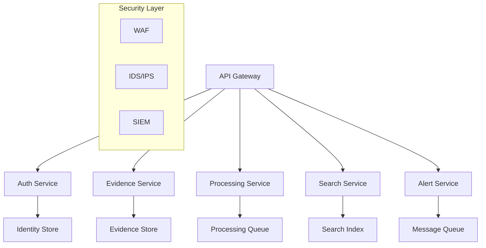

# CrimeMiner Backend

Enterprise-grade, FedRAMP High and CJIS compliant backend microservices architecture for law enforcement digital evidence processing.

## Table of Contents
- [Introduction](#introduction)
- [Prerequisites](#prerequisites)
- [Project Structure](#project-structure)
- [Development Setup](#development-setup)
- [Testing](#testing)
- [Deployment](#deployment)
- [Security](#security)
- [Troubleshooting](#troubleshooting)

## Introduction

CrimeMiner is an AI-powered investigative platform designed for law enforcement agencies to process and analyze digital evidence at scale. The backend architecture implements a cloud-native microservices approach with strict security controls meeting FedRAMP High and CJIS compliance requirements.

### Architecture Overview



### Technology Stack
- Node.js 20.0.0 LTS
- TypeScript 5.0+
- Docker 24.0.0+
- PostgreSQL 15+
- Redis 7.0+
- Elasticsearch 8.9+
- Kubernetes 1.27+

## Prerequisites

### System Requirements
- CPU: 32+ vCPU cores
- RAM: 128GB+ memory
- Storage: 2TB+ NVMe SSD
- Network: 10Gbps+ bandwidth
- GPU: NVIDIA A100/V100 (optional)

### Software Requirements
```bash
# Required versions
node >= 20.0.0
npm >= 9.0.0
docker >= 24.0.0
docker-compose >= 2.20.0
kubectl >= 1.27.0
```

### Security Prerequisites
- FedRAMP High ATO documentation
- CJIS Security Policy compliance verification
- SSL/TLS certificates (FIPS 140-2 compliant)
- HSM for key management
- Security boundary documentation

## Project Structure

```
src/backend/
├── services/
│   ├── auth-service/        # Authentication & authorization
│   ├── evidence-service/    # Evidence intake & management
│   ├── processing-service/  # AI/ML processing pipeline
│   ├── search-service/      # Evidence search & discovery
│   └── alert-service/       # Real-time notifications
├── shared/
│   ├── security/           # Security controls & compliance
│   ├── logging/            # Audit logging framework
│   └── utils/              # Shared utilities
├── config/
│   ├── security/          # Security configurations
│   ├── compliance/        # Compliance templates
│   └── deployment/        # Environment configs
└── scripts/
    ├── security/          # Security verification
    ├── compliance/        # Compliance checks
    └── deployment/        # Deployment automation
```

## Development Setup

### Initial Setup
```bash
# Install dependencies with security audit
npm install
npm audit --audit-level=critical

# Security compliance preparation
npm run security-init
npm run compliance-init

# Build services
npm run build

# Verify security controls
npm run verify-security
```

### Environment Configuration
```bash
# Copy environment templates
cp .env.template .env

# Generate security keys
npm run generate-keys

# Verify compliance settings
npm run verify-compliance
```

### Service Startup
```bash
# Development mode with security controls
npm run dev:secure

# Production mode
npm run start:production
```

## Testing

### Security Testing
```bash
# Run security test suite
npm run test:security

# Compliance verification
npm run test:compliance

# Penetration testing
npm run test:pentest
```

### Functional Testing
```bash
# Unit tests with coverage
npm run test:unit

# Integration tests
npm run test:integration

# End-to-end tests
npm run test:e2e
```

## Deployment

### Container Build
```bash
# Build with security checks
docker-compose build --no-cache

# Verify container security
docker scan <service-name>

# Compliance verification
npm run verify-deployment
```

### Production Deployment
```bash
# Deploy with security controls
kubectl apply -f k8s/security/
kubectl apply -f k8s/services/

# Verify deployment
kubectl run security-check
kubectl run compliance-check
```

## Security

### FedRAMP High Controls
- AC-1 through AC-25: Access Control
- AU-1 through AU-16: Audit and Accountability
- IA-1 through IA-11: Identification and Authentication
- SC-1 through SC-39: System and Communications Protection

### CJIS Compliance
- 5.1: Information Exchange
- 5.2: Security Awareness Training
- 5.3: Incident Response
- 5.4: Auditing and Accountability
- 5.5: Access Control
- 5.6: Identification and Authentication
- 5.7: Configuration Management
- 5.8: Media Protection
- 5.9: Physical Protection
- 5.10: System and Communications Protection
- 5.11: System and Information Integrity
- 5.12: Mobile Devices

### Audit Logging
```bash
# Verify audit logging
npm run verify-audit

# Export audit logs
npm run export-audit

# Compliance reporting
npm run generate-audit-report
```

## Troubleshooting

### Service Dependencies
1. Verify service health status
```bash
kubectl get pods
kubectl describe pod <pod-name>
```

2. Check security compliance
```bash
npm run diagnose-security
npm run compliance-check
```

### Environment Configuration
1. Validate environment variables
```bash
npm run verify-env
```

2. Check security settings
```bash
npm run security-diagnostic
```

### Resource Constraints
1. Monitor resource usage
```bash
kubectl top pods
kubectl top nodes
```

2. Check GPU allocation
```bash
nvidia-smi
kubectl describe node <node-name>
```

### Security Compliance
1. Run compliance verification
```bash
npm run verify-compliance
```

2. Generate compliance report
```bash
npm run compliance-report
```

For additional support or security concerns, contact the security team at security@crimeminer.gov

---
© 2024 CrimeMiner. FedRAMP High and CJIS Compliant.